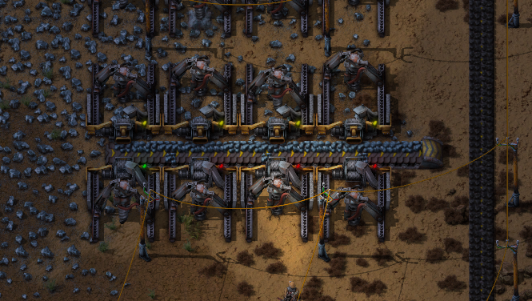
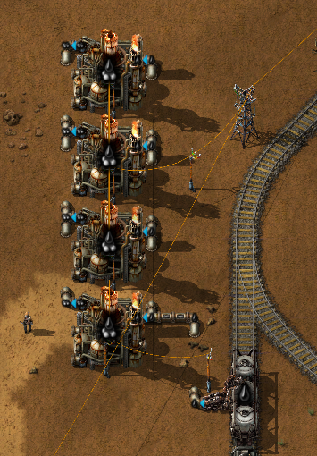
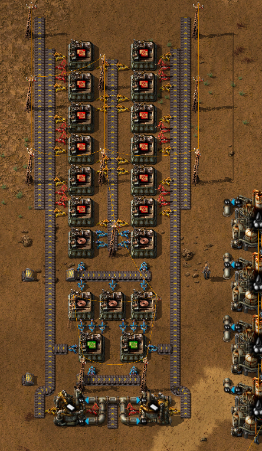
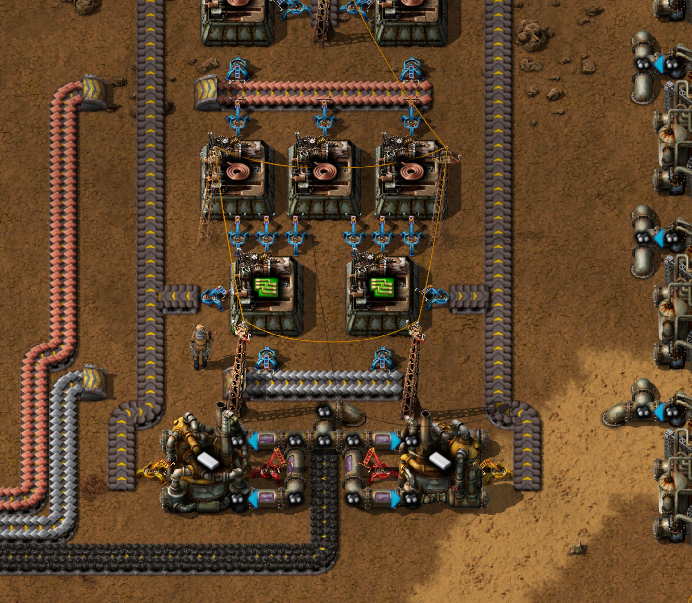
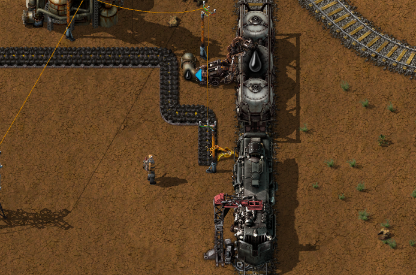
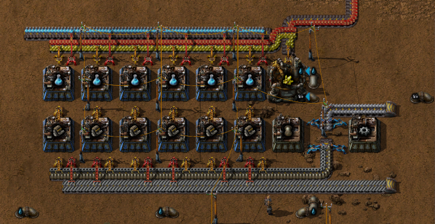
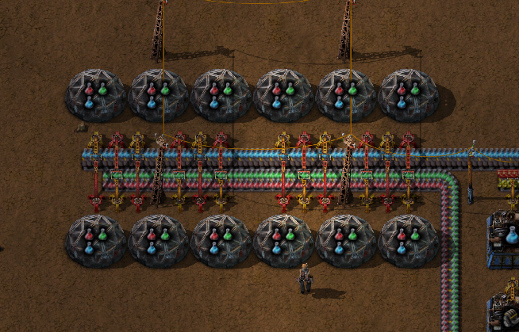
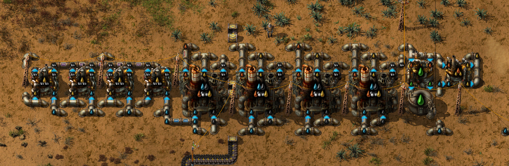

# Chemistry

## Intro

It's assumed that you have a working oil distribution setup via train.

Your task is to set up automated chemical production, but while building it you should do the following research in this order:  
- Plastics
- Sulfur processing
- Advanced electronics
- Chemical science pack

## Oil refinery

Open the map and check up on all your drills. Go to the patches where drills have run dry, whis is indicated by a red light, and move
them to places with ore. You may need to exend the belt to accomodate the new drill placement.  


Go to the power generating boiler/engine setup and add another boiler/engine set. You should now have a total of:  
- 4 x Boiler
- 8 x Steam engine

Create 4 x Oil refinery and 1 x pump by picking up the needed items from the mall.  
Build the following oil refinery design near the fluid wagon:  
<details>
  <summary>:abc: Blueprint string</summary>

  ```
  0eNqlVtuOmzAQ/ZXVPJsqNmADj/sb1WoFYZZaAhsZqDaK+PeaRC1s69S28sZFc25iDr5C0y84GqlmqK4gz1pNUH2/wiQ7Vffbs/kyIlQgZxyAgKqH7U7LPjH4IRWaC6wEpGrxEyq6EsfoR7/Idp8dcTa6x2VIuno6DLP1jQCqWc4S7yJuN5d3tQwNGovupicw6skOabVxbirSbzmBC1SpvbD4Bs/yJqSpJ3lOtuHR6DNOk1QdbJL/ImK71m3wX4L8N8HJEjgA0i8AyayTzuhFtQ4ofoQi0Eqr9v6eO4Cz0AjKJyPIgx2w00MHzAHMPdky6slWhCtjUdkWgdmy/Mlsy3AHPCpbevKFKzzhUhqurYhKl7LAeFP6ZLw0fPtSFpdv5sk3TX357ns1YCttB2JvGY01NtpO/F8/5DeFCmX3o9GL2RqS8jcXB4/k2PfExZETKpw0IpamiLdShBfpn63kQZ9j6ev47Ijn+kmcwrWVD7W5PjMWsYQ0yjXz/dn2Mn/kOny5WB7nOgtHFnGuc59r7nPNwyuFxrkWvkphX7TZI9LtJFYdDm4E+rpBe+KC160iX2xFvhwqksBPNNNdQUEzUTIheEYFK9b1FwubOtk=
  ```
</details>



## Red circuits

For the red circuit design you'll have to create some units by hand, start by going to your mall and pick up one pack of each:  
- Iron plates
- Copper plates
- Steel plates
- Green circuits
- Iron gear wheels
- Inserters
- Pipe

Create:  
- 2 x Chemical plant
- 21 x Fast (blue) inserter
- 14 x Long-handed (red) inserter
- 13 x Medium electric pole

Build the following red circuit design near the oil refinery:  
<details>
  <summary>:abc: Blueprint string</summary>

  ```
  0eNqlXNtu4kgQ/ZURz7Dqi/uWz9iHfVmNVoR4M5bAIC7Rjkb59zXJKDikD1QdPyVB8ely3Vx1qvCv2eP61O72XX+cPfyadattf5g9/P1rduie++X6/Nnx566dPcy6Y7uZzWf9cnP+a/n0suxX7dNi1e1Xp+44e53Puv6p/W/2YF/nlctfuv3xNHzygfD+H4un7fhap7r2r9GVXnWlHV3ZvH6fz9r+2B279v3e3/74+U9/2jy2++GGPq4+7pf9YbfdHxeP7fo4oO62h+GybX8+coCK7o8wn/2cPSysG359Pct0BebEYCneBfMfYJv2qTttFu26XR333Wqx267binz2Ajn8Ouigb7vnH4/b0/58543/XjmkoW7f1iUOFJipg8WLOx4O7eZx3fXPi81y9aPr28HEXyEvGrXl7fb37arbAX/+clxSHpfcpOOy0rgp3TRuyDXjFsodgT2sodCAq1gq7t40XUNzFFoGaF6O5u/L1lBoSLZLjHX9od0fhw+/4jTXvvnUDd75/h+xhnoJtvV28PsfyyF7Pi1kJ+TrE1zthCSRO2tRs1y35b5ui0DGZG7IWNOtM0rdpkZ7gpXIfcsnarp1iodZuKtb5yk0EFOuYXIRlC1QaEi2SOWiBNAShRYBWqZyEZKtUGhANm8mPPCj/gnsrTKTRkksejchkyZJXHp1XZiv7+GqLpxb29TKB99Q2RV4iw8UGvKWOKFeY7wlKXNsFNkyT3g2JJE/FirvAq03hkIDHtFYKu8i2ajmC8o2ofuyzdcoG6J2iDOTqj0Y1YTZACSnurA3mWtokcrxSLZEoSHZ8oQnhtfngKYoa9hGkgOCUaIGEaqlsi2wW3AUGrBb8BNyN2G30Cjr+iDJrCEoURsRaqQyLNJ0otCQF0wgLWo5Mc+ts7WEGCjiAikhUsQFUkLkiAsP0DjiAjCGkSMukGwccYFk0xIXXhIucQpx4SSJNCYq9SGdcoQF0mmZUD46iX6TUZa9XqLTZKm0BLSQOKICWCh5Klsg2TiiAsnGlXaAgk0cUQHo4cSVdkg2jqhAspUJhaIhyH0zIStZSQRlLXlhJNGeuTIP2DB7Cg3YMDcTikbGhkGZ+YzIbnFCxrYiG3IlH9J6ptCQR3B1HZCtcHUdkK1QdZ0BJHCh6joDCOpC1XVQNqqug7IFPreapI/LEnXtshENkopyPGVEI5RCVXvQboVCQ8MuY/iEyhjOGqtrmI1sdGmcEjbLYKmBFdZ2Q8GhmbKhRlZYukjBQekST57+di3hiGK4JSrRJiR5oeAiWnIwVKpF0mmWJrxAOqcrIo1o4mBH6xPq6teIxiZ2tFOhnoHVHOzssd6f6ai5Da7qaJYaX2FTRgoOmjLxdaWJMrNmXUFsksyU1IAKKsJREypoptFqhZryrDra4Ln1XS3rqPkVVgTFY2BFUDMqExBcoDIZhKOmVKZBcGlCTdsQpZHLE1KmaB5kXVEme9G4wnpD5TFkSE+NraAhR9sY+hqXMaT3E/JwkGm8UeZh0RTSKtYzxokTap6aY2G/SFQ2g3AUvWg8gqMWoYxDC6MTNqGM/ey1q+1u1+4Xq+Xj8LSqHmaVna+I4bcNRSVCDTcUl4g1fImhf5eH40J256KJiW2Uc2HjZbATFp70TpGk+hnfiJN5BkUpYlNy9SNytMB1bGjLPXAdG1rBH+1hCPue8hm0Uo7aUl1KsoELOagJKuRElLcdrWIo3FU0aLHcQga2IEXPY61eguk0VBr75/12+InM9MGylK+k6Pzjq2D97lQvbgLzmCuIJIpMpBXEYI3WMgSKCBJFbE9HpAnN2ka6cVYVWxF3UYstD8L4yYCfoJsqNMOPSMVWtHdZi60ISKvFVjzqjBZb8dxzSuzR1se9fOqUbkKtfsCop1Y/YEZKzJitIMYkMWO2guicxI/ZSlBWf6PFEHmWgGoQl5KjtADB1Bu/hddCoQtu9VmZCTikpEyFGHK8TIUYlI0KMdTGZyrEEGWRGQYEozF1I75TZruqoCYnM/RHQR3YaKtD2JSETxJe9yQlzZ2L1Z6kiONkVHYhLYw2PuRpDoJpmcaRgFfd+bv2tv2gv1tU42gpRNxQYfHFheGoCIJgRDuGwdS8h52qWO30Ovmb/jzEx7lxd74+WBwtichzP9QWw4YgNGeYYRrKE84wXEixCM0xaAahyYMpXLnXva9RKzY/LuOXYmVfLZdHmtdCK55fjVYlDAmCPYEhFLEnFIpRyQyj4qj9kIy+eE6th2T0pfjRdohAEVGiCMyoOM07N9KNs6rYjb5qyKJ21mm2QrJWbGZFRIqdCGZCip0JRkWKXfR1itCU1OYIjEXHNGEwFh3zsMvotQ2K1ZDLLkdOspeGMHsiGb2uYrQmsvrRbrrVcr3YrZf9TU43h0oG+igCh8sPx6GUe1zuq4lotEoi7GbilYq+VH+g8nOjNZPdWbhb6QhqKN/DKPcxyj2MfBdjtAdSxxjFI8Sw9zDMfQzthCy5W+Y7uwMYkLnRrsc957xUX1+dMyqc0zNbxDAPeGaJOIuWQJ1nNoqxVeUk4g1NVxOWZxaIc0CCFnlIN+jdRupvjyXlPTdWHvDoTkcLHncx4J0yI2YsEfO6GixbkCc0iBHlCQ1iJDkG1Iz6NTP2Rr6qniCvy4ISOjBf83pXxff5+4tNH0bvQZ3P1svh6uGzP9unb795oMO3lzOT9NLuD+9Rk22TikvNkORziK+v/wOCqFnF
  ```
</details>



Connect iron- and copper plates, coal and petroleum to the red circuit setup.  


Bring a belt of coal to the train stop at the base and let an inserter automatically re-fuel the locomotive.  


The red circuit production requires a lot of copper plates.  
Go to the copper ore patch and add more drills and smelters, e.g. 8 more smelters and 6 more drills.

## Blue science

Production of blue science requires a lot of electric power so head over to the boilers and add 2 x boiler and 4 x steam engine.  
More coal will be consumed now so add two more drills to the coal belt feeding the boilers.

For the blue science design you'll have to create some units by hand, start by going to your mall and pick up one pack of each:  
- Iron plates
- Steel plates
- Green circuits
- Iron gear wheels
- Inserters
- Assembling machine
- Pipe

Create:  
- 12 x Assembling machine 2
- 12 x Long-handed (red) inserter
- 4 x Fast (blue) inserter
- 1 x Chemical plant
- 1 x Offshore pump, to be connected to the chemical plant

Go back to the labs and remove them all, including their inserters.  
Build the following blue science design next to the red/green science:  
<details>
  <summary>:abc: Blueprint string</summary>

  ```
  0eNqlm91O40gQhV9l5Gtn5P5353JfY4VGJvSAtY4T2c7MIpR3XwfQJgMd59ThChHgq+rjPt3V7uKluO8OaT+0/VSsX4p2s+vHYv33SzG2j33TnT6bnvepWBftlLZFWfTN9vTd5ilt203TrcZNm/pNWu2bzT/FsSza/iH9W6zV8a4sUj+1U5vegK/fPP/oD9v7NMy/8D9qGpp+3O+GaXWfumkOsd+N85/t+lPwGRW/u7J4LtarWn93c4SHdkibt5/7Y/kJrGGwqmRkg5OVjGxxspaRHU42MrLHyVZGDjjZycg1TvYycsTJQUZWFY6uhWjchEroQoXbUAttqHAfaqEPFW5ELTSiwp2ohU5UuBW10IoK96IWelHhZtRSy+Bu1EKfa9yNesGNNofG3aile6Jm0AbKGnejqa6js1njbjRKiMbdaIwQjbvRaCH67Ma2H9MwzR8u1R6z3sccpmYKGQVleHbeuG26bpW6+deHdrPa77q0WHRUr/w+tY9P97vDcCoabVUGdZerxM4u7Hb94+qpmavOh9WCKPpDnBuz2iimboIkMpop9jC0kcrihLJYZALaWxPQOKbCwySgylIMDbkv3Bx8zZSKWIaRqW8htK2Exo5Lxp6XCafKYHPetko6iWvZJLaaqXoxlQxTq2NoK5RFK6EsDpjeF7X6leltPVOdYxIE5kyBoWtk8Obm4CNT5EMZuoo5mmBoJfO2djc2ba/LEHLedlo6ia1sEjvDnFcwlSxzysLQjjkKYWgvVTwIFQ/MWQvLHTKlv2VKF5kjG5Shr5hzlcrn6RUy3Ch7PF7LvG3UkrfnlSLqnLH92XfNOKbtfdfOk23bbJ7aPq300sEi1K9x5lG0+6U3y59jWmlM+/WYThozfD2mF8Y8b358zCCNab4es5bG9F+PGT/faOy7pl808Hu0C+fpi9jjoft5GHLBQiU6vgePGDwo9sT9zv9YmAdbxuzmHbTo8Aemb0SHKhBq2cNKTpNZ4dOLiFCqKrv2BVnhDA7BiwpSEBrYQi+riy1f94NZlzqri2z7BocQibdrGLquiHeCn9HZeyf8dZJxQjR+mjVWiBa82vVCtOXrBfvnWp/6x9PfHPp2yi26teOrBGEkz9cGwkiBrwiEkWq+DhBGivzuL4sUq6VIanHn/xBpf/qSC3H2+89mnBaOW+d6O7hPVUWOLK3n9Yfc/1zCw3xWz63d0cADMNcHkL0ot8wC7pAFPDrhg71Yaz882HbY9avH1Ayr308pddln7GXVHHQHGANdzels5XKlZok1fYECDiRKA1hZAFVB1bSTUpWsHgWpmi5IM491niRz7XWl6lKVod+fo6MRv4qupBGgklpJqcKaGqQG+p0mGqGmy3adXfOvLAqqkpr2Yg/GhqIQ02qpvRSz3RqsQ0oTG6FBdnIl6GMyWqoItcsajO2I9oGgMLk9ce8eKowdiIt3lF0zbFCTyGiCsQXtTBdbKaaJoJ/pYvMH2Zphg5oYRhOQbYnLf1QTR9z+o2zPsEFNAqMJyK6JC3lUk8iwsbxNRfQooGym6xfUxDBtv2jeTN8vyrZM3qAmjskbZHuiKwDVJBDNDCi7ZvIGNWGaMEC2rYgmAFATq4jeBZStmbxBTZieC5Rtie4CVBOm6wJleyZvUJPA5A2ya6JXAtUkEs0SINsxbfmgJo7py0fZmuieRzUxRPs8yrZM3qAmjskbZDPN+agmgWGDedfM3STIjswNIsYWNEgZ6d7gFXM9mWHflW//3Lq++F/YsuiamTV/9tf82bf3PpJvv063CL/SML691qnnxTjqYLUxtfPH43/cciG0
  ```
</details>



Rebuild the lab setup so that the labs can use the blue science:  
<details>
  <summary>:abc: Blueprint string</summary>

  ```
  0eNqdmd1um0AQhV8l2muIYH/Bz9A3qKIK45WzKiwWrKtEkd+9YKuJ24L3zF5im29mzs7RwPiD7buzPY3OB7b7YK4d/MR23z/Y5I6+6ZbPwvvJsh1zwfYsY77pl6uu2bNLxpw/2De2Ky9Z9I7mHIa+CW7w+dQ661ubn5r25x2FA5RuOLopuHaLIQBG+2p71zbdFkNeXjJmfXDB2ZsY14v3H/7c7+04l/uJ6u3BnfvcdrYN45zVaejsHOg0TG6pdElhKcw8q4y9s10u5bOaA3nrjq/74TwueJ7p4mVJ+58onBhF6EdRyszwtSjiryP9P3X5CeUzdAUgIwATA6jHAFHEADoCEDGAiQB0DFBFAHUMUN81uD/mr83ciYfc+cmOYf7+0bEU17M+uHFujusP5Aq/LD4DPIAqIrSkZq2JATg1QE0MIBBZKiJUAtC7rsagCoEKIlQjUGpXGOKhCWovV9QAhhigRmQhdgUvqFkTe5l/uTGMjZ9Owxjyve3CSkfzP+ilir/RfA3NU9A1hBY4WhDRMgWNCaJwtCJmrXG0JKJNChoTpEoRBEPXONrQBBEFjtZEdJmChgQRPEUQDE1wY00UhODGiohWKWhMEJ0iCIbG3ShKoiC4G7+eQ0B0nYKGBJFFiiAYGnejIE4ZibtREGejFCloTBCZIgiGxt0oiLNR4m4UxNkoTQoaE6RKEQRDE9xInI2K4EbibFRlChoSRPEUQTA0wY3EUaAIbiTORqVS0FjWGl0dLW29uvkxyOv3F8ZsYKgvhHePoFtI5BXw7sFtA6OL5E3hFQnu8HSJ7uC2TkJzpN46Wq+gnkQVRUp0PbhZm6K+eRfRpDQVKaJIg24xN+sk70WiNtDQJiRqUFOgC9at2kyJJGKiiaTv1Nf8ONt71Y+GagMRtYGBlopRgxqFbqpvJ/GS3f472d39TZQtt9pu/uxbs5+e+NPb0zJQpvmLX3acbvOiKqWpuTFaloZXl8tvtP5+HA==
  ```
</details>



## Advanced oil processing

Start researching "Advanced oil processing". While waiting for the research to finish, create 6 x Chemical plant and 1 x Storage tank.  
When "Advanced oil processing" is finished start researching "Lubricant".  
Change the recipie on all the oil refineries to "Advanced oil processing".  
Build the following oil refinery design:  
<details>
  <summary>:abc: Blueprint string</summary>

  ```
  0eNqtW9tum0oU/ZWIZ6iY+5C3fsdRVBGbOqgYLIyjE0X+94LTGtLMeK9N8hY7sPZtbWZf8Gvy2JyqQ1+3Q3L/mtSbrj0m9/+9Jsd615bN9N3wcqiS+6Qeqn2SJm25nz51dZP11c+6rfqX5Jwmdbut/k/uxTkN3Ppc98Np/OZ699sV2bYbFvfK4L0/m1O9ne88VEPfNdVpn+3K4+JmhdzcnB77elO2S6n6/JAmVTvUQ129WX758PKjPe0fq340aZZdj6BpcuiO48VdO8kZATLzzaTJy6h/8c2cJzX+AZDvALKhy3Z9d2q3ASi9hEqTbd1Xm7f/2wCwgoFlFFcGcDWMq1j6GsKTQvyF82FPWhggEgoHWyZ4LvMrgD3is4IyWREmixxXjUc/IXBkGzU65E0hKasdwRShYISY3/AsEJ7FFWFWIENkEWSCFJTVeIbInMcWPEWk5LGFyhGpCLbIHEaIPePxXJCaxRYpVyBDbJFUjkjyZMNzRFoWWySeI9Kz2CKpHJEFxRYHI8T8hueCynkxLVYgQzxUVI4o6vBVeI4oySuE8BxRmsUWReWIMgRblIYRYn6j6iZFnWWK4ryyFALFeeUpBJzzWvCYST3/tSR003iNdK32p/QJYs0s3zxV+7HdaLJDM/UcH7H+nioT3d/bOZJm/Lu+NDFNvXsasqnh2vTl5lfd7pKQXKpmyiSlOcX1LKcQKK5ngkIwsPfyr3QeWThRelP5QbrOUwlGAZBVEAFgctj1+gtdb6j+mko4QxFfUwAU7x0FQNHeUgA46/1Xut7Cjz2/tIBu9B3aqEc94sOTpnj/q9RFs6sLyu1z2W6q7cULh77bVMdjzA9wkx1T165osj+6MnS4WSo9BJUfFm6mowiK3+hjRLEaDXPx+TBbg3bHUUdYfncMhpnsKaiMsR7tYaMIBb9Dx8LscjDM147zE2F2Am1rY45wkt/WYmF2ZMtN5aLTaPMZRVjRWoNhtmCYr63iZ8Ls0H406gjP70fBMFMHiqJy0ePF2LV3mwxeOnO57fgoQKANXVRFideL+XsVlzxaKPxUlc8vZNXiFdruXaSFEDSMELN9zqF9ta1P+6xqRotGd2eHrrm1JPpTt7XVWKE9dqd+Wjl59xCSYVc0pepDVRhCdkzt5S3lTep9UH/PlCLymz5KhQjLmZPtOHR9uRtdVba/biWKDke1wKu4OTtUBAvPLxlBkDBLYwgKXV1GPUI29JpCwE+beRyioc2YhQceJqKbgxFi1uFHyDz6MJB1xQpkDa1L8hye8+jYThEf5eZRs8PKST4yRBeRK3TGY2JWaxQh6jfDXtljdBG55SODdHHoZCpqNWP0y2RLwUfG2CJydCwVY4uAB1sxvwk8FyyPLULxkTG2CI0O06JWG/5UCmMLuR4vyJg6FCFqHbsq+ie076siP1ZFxUNQUMEt8uQNQZPeQuZBSYvtOSjJ35RUjJJEWJJgSlL6lqRRcSFlWJJkStL5TUkRexRKJxuhkySPpJyEgF/LikPgh888SnXQk4pctl/fp7oABiE8DBE1ED9n5nmshQwk9+rzwDimHWOxPs96HfTIZGzW5+kpFllytX59+SkaWXK3PkNEfWdWGGgx3zFKMsEkDTkuJtOesY+XikkaxiDZ8EijyTe1NEUaLWCImO+0XGEgRhrNeKnX8UhDbufnYXbUcEb/UvBIo/FsmSe7IGnIDiYnSeNhiKjvihUGYqQx5LtZ5AlnGC9nMc8QckGvyAe9USsmc/bjLPQhffsZw/3iVw9p0pSPVTN+9/3P9uGuq5u7eftw9yzGi56r/vhmox8JVUjnrBZO+vP5N0YAs9Y=
  ```
</details>



## Summary

By following the guide above you have now set up automated:  
- Red circuits
- Blue science
- Advanced oil processing
- Lubricant
