# Nuclear power

## Intro

It's assumed that you have followed the previous chapters and thus have a power suit with a personal roboport.

The main goal is to set up electric power production by using nuclear reactors.
To reach that goal you will set up Production- and Military science, among other things.

## Prepare for Uranium

Your first task is to prepare for Uranium processing.

Start by doing the following research in this order:
- Advanced material processing
- Concrete
- Uranium processing
- Lab research speed 1
- Mining productivity 1
- Stack inserter
- Inserter capacity bonus 1
- Inserter capacity bonus 2
- Modules
- Productivity module
- Speed module
- Advanced material processing 2
- Production science pack
- Nuclear power

Drills that mines uranium ore consumes sulfuric acid, one unit of acid per one uranium ore.  
Due to how uranium processing works you will need to mine about 57 000 uranium ore before your first nuclear power plant is up and running.  
Thus you will need about 57 000 units of sulfuric acid, which translates to 5700 sulfur and 1140 iron plates.  
The good thing about sulfur is that it's a solid item and can be carried in your inventory, unlike sulfuric acid that must be containerized which is more complicated.  
Build this simple but effective design to get started with the sulfur manufacturing, place it near your oil refinery:  
<details>
  <summary>:abc: Blueprint string</summary>

  ```
  0eNqllEFugzAQRa+CZm0ibAhQrtFlVVUEJulIxiDbVI0i7l5DWpo2piB1h/H4zeeP+Rc4yB47TcpCcQGqWmWgeLqAoZMq5fjOnjuEAshiAwxU2Ywr08tjr2FgQKrGdyj4wFYP9bpU1Ddhq/HmpBieGaCyZAmvvafF+UX1zQG1Q8+AjhyVQdcaV9yqsZEDhDzd7RmcoYij3X4YhfwiiO0E7ifEM6F6xYaqUoadLJ1pHlbyxRKOxaAmjdW1IGXgnqn74eBdr2Tu1WA9+oXSATRVYddKr3qxon6/+v3RioPpdsKChmy7g/k/Dcy3jzv2i32YCcfS2JCUQW3dxl/e34v1gHn0/QtZRBk6M4z3FvFbro/Et2uMFjUKH1lsH/aCfzzePoJkAZFsVzEhXIpMcVPcRBoDWR7QJRI8TrclOLY6+IyhwMVQUGuSktTJVb6hNldPcp5kDyLL0oRnIh+GD9JvpQ8=
  ```
</details>

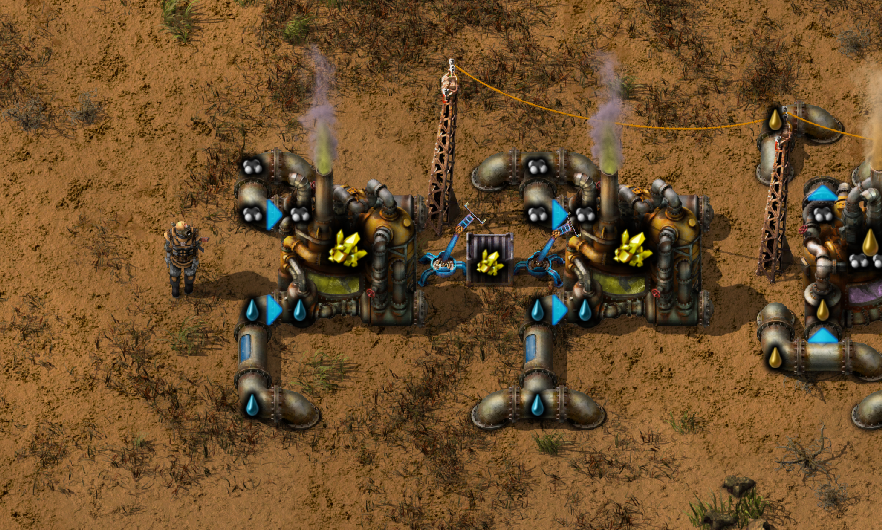

Next task is to collect the following items from your factory:  
- 400 x Iron gear wheel
- 200 x Steel plate
- 400 x Red circuit

Then build this concreate design and put 40+ iron ore in the input chest
(it's ok to build it even if the concreate research is on-going - just stamp down the blueprint again when the research is done):  
<details>
  <summary>:abc: Blueprint string</summary>

  ```
  0eNqdl9uuojAUhl/F9Bp26IEC3s5jTHYmCN3aBFpSys4Y47tPkRFR63aVOw5d3zr17+GEds0gOiOVRdsTkpVWPdr+PqFe7lXZjN/ssRNoi6QVLYqQKtvxzY2rjLACnSMkVS3+oi0+Rx6zb2ns4L7MltOIuNZ2YUu8tvcuB1MqObQxofnCkgZZpgtLdv6MkFBWWimmnC8vxz9qaHfCuIRuMVutRPw1GFVWwnE73TsrrUaPjhRjEqGjMyDnMZoHDJkxZd+LdtdItY/bsjpIxyQeWv6RTjj8kbpwa2lENf1nEXLPsnvowJNLOrtstHN2KF3GdSxVL4x1/59d8qvL5NEl9+DZjIcgn7IgHmS6qLUQTVwdRG89VLYM1MPhQE66jM7DySApYnKl0KdOeZg5iJlcmQTSimJmdm5axFbHe6MHVf80rag/ZZxA4iuCUsY3DbWiHjUoGjfeyCrudOOTUnbPV0LuDzs9mFGhBH/6fAQLbG4+WyswHKww9rKt3rqBJJYumT7KTVXWLYF9p42Nd6KxP85lBtEr5gFoGobOAtD4ik5BZc3XoBkIXYB3i+J/xN7NAiTC7GXWvjWCBIvwNhn4swqdpin1CZGQNdXNIHOC0DVoDmkcYQHoJCzqAP3lL8neoHnQWg0rRIDuirA65EEHBli0cL3xCZv79EYT+AaaLgP0sfCKdheQZClZQc5BZLp6gy6gGzQNOy/CKpKGH3wIBpF5eK1JApEBDRAYDyMH7GtZGLkI1weszuxeeT9V98XxhuF3BP6OQN4RsncE+o6Q3hHclfNyN90u7t0RakrXLPft1+XIWVqx+dJmo4aqEaXZdKWxvRv1LUw/NSrHLCtIlnGGM+LWtX+OZRjN
  ```
</details>

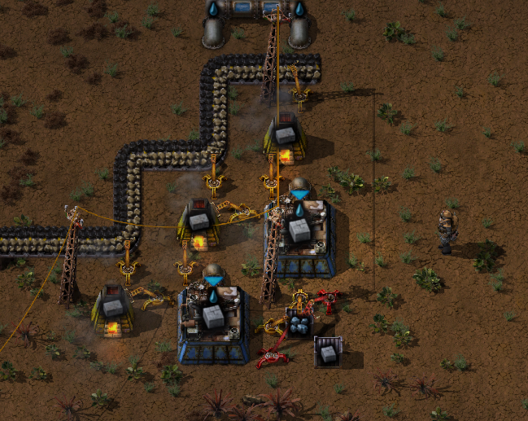

Go to your old Rails and Stone brick factory and stamp down the following design.  
It will create Steel furnaces, which are 100% faster than your current smelters:  

<details>
  <summary>:abc: Blueprint string</summary>

  ```
  0eNqVktFugzAMRX+l8jNUA0Jp+Y0+TtMUgttGAgclYRtC/PsCtKho0cYe49jnXlu3h6JqsdGSLOQ9SKHIQP7ag5FX4tVYs12DkIO0WEMAxOvxZSxiFV5aTVwgDAFIKvEL8mh4CwDJSitxBk2P7p3aukDtGhYENwbropJ0DWsubpIwjJ1Ao4wbVjRKO2CYZPs0gM5Nsn3qhDQK2fgs/JCKFylJBrV1td/wscN7KMlC+VSqRArFDY31kNjLg5RORgs+evAQ2SZfpzWtlG7xucHHTDcx0/Up/2Aetm6esDV32jzyELNNLpN/uTw+ZVK5DD0C4QHH94MOY0inPOdP8Q+g4gW6yMN5TNbuDtpduLBKd+7/A7WZfRwjlp3iLDuwKIuPw/ANoQUO/A==
  ```
</details>

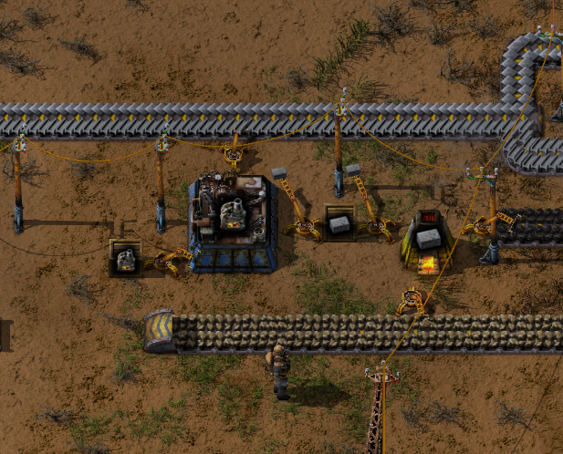

You're going to need some additional electric power, so create 4 x Boiler and 8 x Steam engine and head over
to your coal power plant and install them.
Also add two more coal drills to the belt that feeds the power plant.

Prepare for your uranium ore outpost by collecting the following items from your factory:
- 40 stacks of Sulfur (from the sulfur design above)
- 4 stacks of Iron plate 
- 14 x Drill
- 1 x Radar
- 1 x Offshore pump
- 1 x Chemical plant
- 53 x Red belt
- 4 x Red underground belt
- 1 x Red splitter
- 3 x Steel chest
- 10 x Inserter
- 10 x Medium electric pole
- 50 x Big electric pole
- 10 x Pipe
- 50 x Underground pipe

If you're still waiting for the concrete manufacturing to finish, tend to your
ore drills and smelters and make sure there are no bottle necks in the production.

As soon as possible pick up the 400 concrete and create 4 x Centrifuge.  

Open the map view, try to locate a patch of uranium ore. If you can't see one you'll have to do some exploring.  
Place a Big electric pole at the edge of your factory and start walking towards the uranium ore patch while a the same time
placing Big electric poles in your trail. Your goal is to extend your electric power supply to the uranium ore patch.

Build the following Uranium processing design at the uranium ore patch:
<details>
  <summary>:abc: Blueprint string</summary>

  ```
  0eNrNWttu4zgM/ZWBn52BdZeK/Yt9HBSF66itAMc2fBlMUeTfV05nEjdrJaT5Mi9F40TnUJQoksf6yJ7ryXd9aMbs4SMLVdsM2cOPj2wIr01Zz8/G985nD1kY/SHLs6Y8zJ8q34x9eJlefXbMs9Ds/a/sgR3zuwN97as4stodQhOa192+D3W9wOAAjKkvmzAddlyoxUiBGmkXI+XxMc/ihMIY/OfsTx/en5rp8Oz7OLEzwEs5jLsxogxd24+7Z1+PEb1rhzi2bWbeiLdjsviu8uw9/mst/64i1T70ceKn38jZ0CsGjmUQ7gaDXmEQaAaLZJBoBoNkUGgGjWTQZ4aD38875bxfu7b29yjEiaLx4fXtuZ36eS9J+7hCY+7EwwoPXywHg2wpu4FDITncBg6O5GAFJfpgFKQAL0AUfO3svB12xp2QI27olqdX17eVH4bo5myN6RLpoRl8P8aHd4IP5iQJw9VYXAX1jKJ65hLd3TxujeNq66yhmC8ou7Hdvfbt1Ozv4RUJvEugDqP39a5688P6phMXB9iTA2K6bj59O8y/YvOf3u+XOSzET5IfH4+r3I6w8X/bcC+zUcL39zrfo2DbVgQ4AXxuZtgJ4JPzLR+tJTYuKbOAOQqdnrnDzkKTEqcx6yHIzVfL49bx/ecWSttub9me/6k/22nspnHtNOIWXWtwfc35pdYQNrdqrdzgjlQLpNwm0KHNJXLBBduwMgq0MqFJLIxAB/yipgFOCx3wXGApJKk2S645PsgZ1nKNpsCehmJDAc7cfefgQ5rZmyEdDwnH10JaoDM3wx62skDPRl5tIFAzJPHV9yIYNGgqHFS7LnHN/1Leqdwa+7Z+evZv5c/Q9vPAKvTVFMan+N3+jPYS+mF8wskYs/QylrMOMzu+ag9d2ZfjTJL9kx3hxR6zCwfMDzRLVH8SfQot1xfmeHTZIRmWQlEKTBiFplAYSPEkDbZrA+JaiqKxFsQ6j/tT25wVbjWaHUEGgi2HKgg6EJCCwZZDIZdD4ZsJhTUd30xILMVVVA9dHcaUi5ZHBgAar/Fhk4HSlFYItswGozSkygllUSg6geIo0wV5VBdbJAyJkTCSSUwzdGpXf4j//mQu+XUyL1J+4JQcJdf3jhYUUJUAlRukULFF8NMKnVRTNusNIuU2mw0686Rs3pD6+XV4XtXvCYFBO9RJlTDYFCiUxJ41jHLeKch5Z0iSYMpuQdO2JCQxGUlTgmAkiiY9wEg0rYWHkRjK+ScSC20poDwB6jZq4AkjbUGRpEHvWi0pUBN+sKTQTDlDUJRtmDMkTYLmWyRoq0gSNF/Vq3RKsrKapuXyDVquNRSJGrZyliIXwygcRS4GUbiCouvCKBhF14VRcJIAyxHvVJygCLCw2UhKoki8bnYkuSzxTtxpwv0lU4CcYQgXmIAUliJdwSgcuiNJXUMoSCoYyFpWMOydj7S5iwswb/4QqrLedfXcIt/WdPTaK7xzTzVM9cs0h3dZxe54lVfcbyrY3ahhhUT1JkkYtbFMA16VIr4fT5ptaG1DEtfSOoUkrqOo3tpBX10xBmhZL37QNmEvQ91gWQCaFOBVGXwzesVXPMB1OQHV+5bYJ33yMf8Uzh4WF4/zrC7jmRWf/RsOXe2/TX05zVLJt4VUkmc/fT+csLll0jhujJbMcHs8/gfO6mJL
  ```
</details>

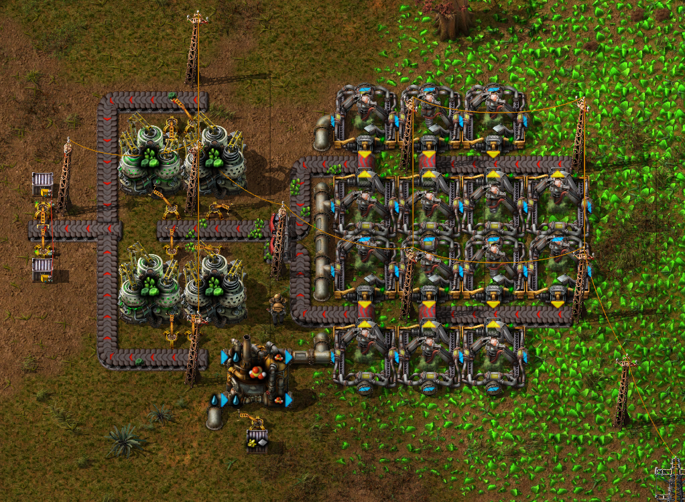

Place the 40 sulfur stacks and the 4 iron stacks in the input chest of the chemical plant.  
Place a Radar near an electric power pole.  
You're done with the uranium processing setup for now, it will stop processing when 40 x Uranium-235 has been reached.  
Go back to your factory and get started with the next task.

## Increased production

Make sure you're following the research list at the top of the guide.

Your next task is to increase the production overall, especially the steel plate production must be
much higher or it will become a bootleneck when creating production science packs.

Start by increasing the amount of drills on your ore/stone/coal patches.  
You should remove your current drill setup (drills, belts, poles, all of it) and instead use the following compact and tileable drill design:  

> [!IMPORTANT]
> Upgrade the belts carrying ore/stone/coal, from yellow belts to red belts.  
> Let your robots do the work by using an Upgrade planner. You can import the blueprint string below.

<details>
  <summary>:abc: Upgrade planner Blueprint string</summary>

  ```
  0eNqVktFqwzAMRX9l6DmBJoQmzW/scYzhtkow2LKxlbES/O+TWQqBliZ7smXdqyMszTD5MagrfnmjiDBAP0NEZk1jzHervMcg148ZhuBsfuObR+gBiTXfoABSNseRHWE5TIHUBSEVwO6lGtGs1Zqu+AP9IRWbJA6KoneByzMa3kQNKnL56FmAzQ7gJNIwBifnP5DPXAu02wGN3mhmGcku2Fq9QKo6fUpwcfQ3v6hHUmZVSDPa7YlUudcN7+svlj5ykB39feHK+8IVYJToJfNuxSaL97ZIJPUtu6cdSYmuatpT3bbHpmrrLqVfKBLsKg==
  ```
</details>

<details>
  <summary>:abc: Compact drills Blueprint string</summary>

  ```
  0eNqllN9ugyAUxl/FnGtsCvUPer23WJYFlTUnQTCIy0zjuw/d1nStrqG7IkD48fGdj3OCSg2ys6gdlCfA2ugeyucT9HjUQs1rbuwklIBOtkBAi3aeSSVrZ7GOW9Soj3FjUSmYCKBu5AeUdCJ3GW+id7GzQvedsS6upHIXBDa9EJDaoUP5JWmZjK96aCtp/RV3xBDoTO9PGz0r8MSY811KYIQy2aX+ogatP7fsJ7PcKz4L56ch/EM4n4Xwkz+NvqUX+296dk3PVujpb/rgi2aP1vhxi392/5ZPfgJiBtcNcwpu7sser7YfpxViHugPL0L84Wd6Kxsc2vgsuzNKruGzC/wKsHg8jhsG0H2oA0mIA5SGRyS9HxHUGwmhLPQ5LOg5//ivWwUI/aL8sK3Yd8ulvZYXHZ2AEh7l155miX0UR7VpO1G7SOgmcqikqJY0vkvbLyDGaZIXLM+zhOaMT9MntAUFWw==
  ```
</details>

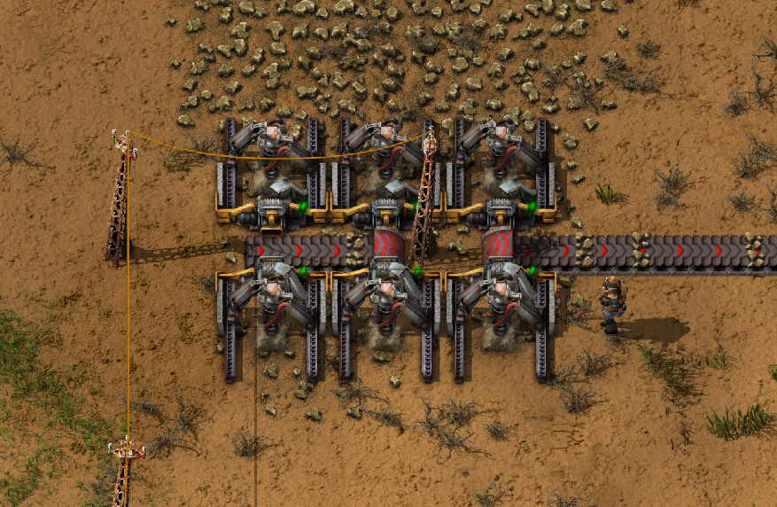

Now turn your focus to the smelting setup.  
Start by picking up every Steel furnace from the chest at the little Steel furnace factory.

Go to the steel smelting setup and use the upgrade planner (from the blueprint link above) on its belts and furnaces.  
When the robots are finished with the upgrading, extend your steel smelting setup to 32 steel smelting furnaces in total.
Use the copy tool, i.e. press Ctrl+C and select perhaps four rows and then stamp down new rows.

Go to your mall and offload (recycle) the yellow belts in your inventory to the respective wooden (input) chests and pick up more red belts.  
Go to the steel furnace factory and pick up all furnaces from the chest, then click the chest and restrict it to only one single stack.

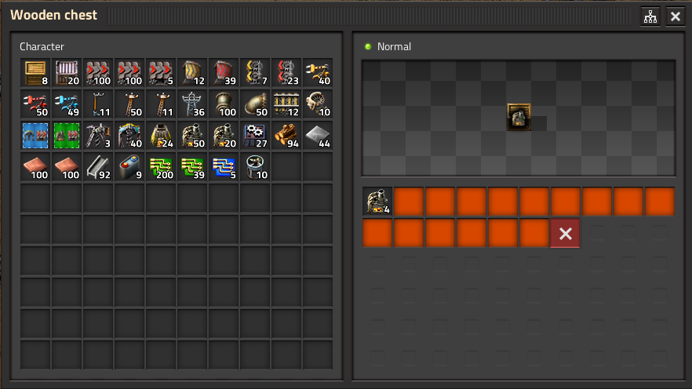

Go to the iron and copper smelting setups and repeat the upgrading process here too, but this time just keep the same
amount of furnaces that was already there.

When you're done with upgrading the smelting setups and still have steel furnaces in your inventory then go to the steel furnace factory
and put the surplus furnaces back to the chest.

## Production science

Now that you have increased the production of metal plates, stone and coal, your factory is ready for the next science pack:
the purple production science pack.

Add the following research to the research todo list:
- Flammables
- Rocket fuel
- Kovarex enrichment process
- Nuclear fuel reprocessing
- Electric energy distribution 2

Build the following automated Production (purple) science design near the blue science:
<details>
  <summary>:abc: Blueprint string</summary>

  ```
  0eNq1W9tu4zgM/ZWBn+2F7rL6Ffu0L4tikTieVtjENmyn2KLIv689naZuKieH7MzTTNP6HJIWJeqQecm2+2Pd9bEZs7uXLFZtM2R3f79kQ3xoNvv5s/G5q7O7LI71IcuzZnOYf+r6dnesxtg2xVDFuqnqottU/2anPIvNrv4vu5OnPIHyFPvxOH1yBnr9i2LXjotnFenZvxZPatKTcvGkOd3nWd2McYz1awh+/PD8T3M8bOt+cuj89KHexeOhqPd1NfaxKrp2X0/YXTvEOSIz8WzKHzbPnrO7QqrpvxNRU8eHx2177Gd4Ke5nUy841LuFY9vUxfdj32yqFPgbtDolYDQKY6/CmDNMbIa6H6fPPiGody/F5GUCxZ5R9m3zUDxupnjvinVE/RExz3axr6vXPzAJfAdYaW5a6YlWWqKV5Rn/+2YYi7HfNEPX9mOxrffjZ/ji3WJZXuK7BH4g4lsivhTE5V+8v0cZEus/n4hTKSAl0RNN9UQRCRSVQBMJJJXAEAkElcDSCMj4joZPDpCn4avLpbrAVyl8YjaTl2hg40P2K0HDp25G6iKHj9Nm2j/07fTvCsPV7Sh/O8fb49gd50LhMyMxqS01YpodMQzfUCPmoYjFZi1gxBT3VxxKLgFiirsr7qTOU+XZ+AHCJ6Z4SY0PMcUDEV8Ltv1QimvJth/DJya0pJ4RWvMJsDdAPKWloBJYPgEWIuoxTT3nNDGJJbUU0yXfA+wdBL4HEIEh5rGkFvaGmMiSWgwYxfcAC5Hme4ARUDPZU0NEzWRHJXB8D7AQeb4HGAE1k6kHsgl8Augd2PdM3gxDfdjuY/NQHDbVY2zqQiWubYsY2R8ME37srstvn2kloI8s5Qa/IuMoBMfextHUMOhfEgZEzFrexNfMt1TzxS8xn39jXnPEsxHdCmIJhFjfNiwQpTj1EfK2YCioKqt0KUMdklm3E8Ipor+G6i9ZDl7x17CvXA6y07LxsTg4YuqWq5nbb+LcTZh7IsP8x0NXT6/sMKXzvp5bHyn2i3xbf7/l7SVTEpdMuA0ZiMFZVrIX0Yn9vKONMb2VecHeeOyKdi/ZiGYFUbEFRIPUAl6zBT4M3xDVenNJ8EGs935W63NpVEqx9/y8NUjeer6UZCF8TwzW8iKdipbJpdXJSCEnpBRX7E9ph556YC4LS51OgFIQq0YNNcEksYbEUBW/t6aQbCo1v7mGERjqG9S336Dl99Ewox2/j4YReGS1COpqoZ6dy0vBWqwDv+MHhSIIfscPI5Dsjh+Gr9hHNIbPP1BX3mkwbES1gmjZPSQsBu4LXTfF6boFuKb1t+NdfqEDphgdsBDYZYVCNhopBJtAYwT8HozCZj4Uv8MAMnyhCwMyIMLP8jIDxt7yhX/Q8C90X0AGz1fmQYaSL82DDIGvbGMMUvClbZBB8qVnkIFaIi+2CokxUGvkksxAnXryZAZqyezIDI5/kwAZPP8yBDKUX5gEFKlJ2Nyb9CRg4F9hMF+og1DLOwzIIImXGAkdP9R5p+WNAzRc8xsdIqQbHU8Tw5tKSlNPpYKOcXIYqd0c9Vt9pI0yoz56oo921cdzor91EJJ8JXopuNg+k2CBrdmnjW+byfwq9tUxJm8FUiPKV7ht+WJAiiyoX5petV1X90W12e7TMb+cloLURYHNui4Gpa7AGjKsYRefImBj2JZdGqIMjl0aogyeXRqiDCVpYxVQq00u5qLWUQUV1bBbR8Jhg/VsGQwlUOxvEf2MEdhqkNSpKEV2hS2QoQSW1F9H15DjqnCo2Z47io4SlFxdCSUI3NlwkMAKei9crDSupZXcSWfUWsWV2VACTW1Ayuu7gp9btbl0LrkzWP5gMuqQZat6KINjy28og2fLbyhDya+AsL3OBrb8Bvrg+OPJKIPkV3EeY1B8hpVROOk0vzIErTZ8BjDyll97ggyOuvEtkiz1peq5Frp/vXVPmO9fbc+z/WYyevrsz/PM5befM5ffnuT0+6e6H14vK+V0ggflvTPSq/J0+h9QX3My
  ```
</details>

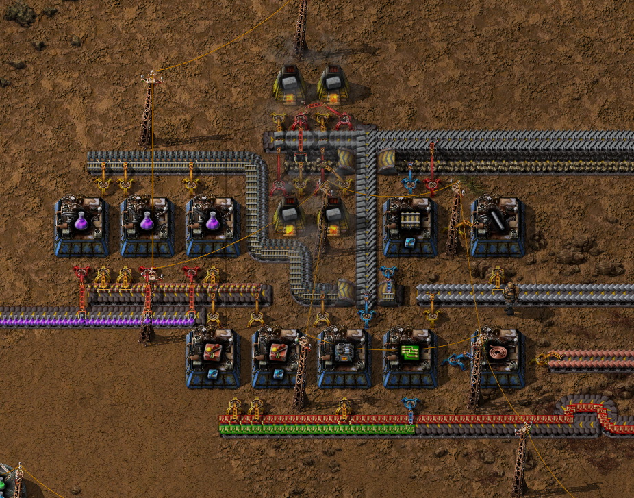

Extend the purple science belt to the labs so that blue- and purple science shares a belt.

More red circuits will be needed now, so head over to your red circuit factory and use an Upgrade planner to upgrade
all Assembling machine 1 to Assembling machine 2.

Before starting the next task you should check if there are bottlenecks in the factory:
- Increase number of smelters?
- Increase number of drills if needed. Don't forget to also check the production of coal and stone.
- Increase electricity production? if it's near its max capacity you should add more boilers/steam engines, you know the drill (pun intended).

## Nuclear parts

Take a peek at your uranium processing, it's important to not run out of sulfur.
Pick up as much sulfur you need from the little sulfur factory, also pick up iron plates: one iron plate stack for every ten sulfur stack.  
Travel to the uranium ore patch and restock the sulfur/iron chest, then go back to the factory.

The nuclear power plant setup requires many different parts.  
Build a temporary factory that will build all the parts for you:
<details>
  <summary>:abc: Blueprint string</summary>

  ```
  0eNq1W11v4joQ/StVnskqdj6coP0R9/2qqgK4YCkkUeLsblXx368D3AL5gDPD9qUtlJzj2J45Myfm01sVna4bU1pv+emZdVW23vLfT6812zIv+vfsR629pWes3nsLr8z3/audzq2v/6x3ebnVjXdYeKbc6D/eUhwWDy9urc73vu2alSn11bUSuPZIXJv6+rrw8LrwdGmNNfo0+uOLj7ey26/c6Jbi6/L3vLW+bfKyravG+itdWIddV627tip7VofnC/kjXngf7q80+hE7oo1p9Pr0ieMgB/iSii9o+CEVP6DhR0T8lAYfE+EzGnxChFc0eHUL39aFsdb9YwycXIAfw6bEUUe0UWdE+JgGLwIifkjEp4YsMWIFNWSJESXIIUvEv4TsXm9Mt/d14T7fmLVfV4W+SxAfCUpttrtV1TV9xozl6xQJMXCpc0QMXOoUKRo8dYcSA5i6QYkBfCc9RFOKFfAlUUKSKPiaiBFIvihiBCFbtjD8CBaWi96GAO4gajtXJDXbpnK/HytiOBr54qsOK+vOelOEfAGW0F5VbC3D8FPyhEXIhFWdnZsxvjqHyB2FfHUOoXqUr84YvmSrJ4YfstUfw4+4wonBDyLclK1uJjPHbcqbgkq4MgOFVqi48Ng+T9mZJ4DwMza+QPCjAF3Iq4wzGnkyhSzYGQaamUiy8bGZuURo3rZ6vypMufX3+XpnSu3LuynmdAMO3hzT8NksGFNE8OQHxMmPiYMXc2Mf2SxjLnYAY+vADmBsG7EDWGUQfsavhVQ6YnhcC8UBmTB+jpAd6NgMxpLdaJ7v56bRdH2rUgsRRFP9ZhySdW1yztZVaZuqeFvpXf7LVE1/0do0687YN/e/zRfSu2la+0a2OnuT1Oa9Y9rv33W1r/Mmtz2P99M7nD5QnsbT9rCi/9HozbU1adwrlR5eD1OqHMOpSd5MxBRUzAxgcHtw08/Ewk3BK3abqhRkTVITkPgqlVUyM+MZHxIacxKwO1+QgN+7gwSS21qD+CHX0AbxoydkJZnP8vMdYxKzhRK7I2oPnxDxFdfuBvHTJ3SXtyLsHh67IxVwe2wQX3A9AhCf7bCD+GyHHcTn9vAgPL2HnxMcldCrhQRRX6WItd9wiwyeMSyETKfqPpVePxrWhb/e6faehX6GB8usOLzi7N/Ikpm6S2XoTMaPFiUlhi8xO6SCW3dh8MTgVbSNlYZceAXBE0OXqGVpDBv34jLvyCPhhF85RjPbUPEh4xlIfs8OPZpK2aabihH8LGALN4Yv6KbeeGamfKWMbbphM5/xTbczwUPTLWOYbuDksE234diHx5PGVLDghvP3IP+2TzE6VXWxKdLoSZviVj9FMCegmSIuQjy3CKapSn+r88b/vXMlgbuyv9vjONta642/rzadq0GWYnIcKVdgsBDPuPBQHIog4GdtiTEIPkOIMUh2GgcJwieacMmwWkXAP3RzJgQLYhEwugNw4RnNgvx2j/XbctdsqS8CxY1hcHuyUxC4kBnfGhXYEbwnshDI8ITRCDLwTwmhDHyvESSI2GYpSPDEgSEVcLwzIdhHhtB7Umw/EyRgn99FCfj+IkYg+QYjSMB3GEECCTcTcrBhv+ER4f9fSrhI17EG4muXCOeeDwrJPsCETm3EdldBAu7ZYhQ/IXYi4WCH/KVORAxPLyKeYoDdYkosR4cZ4qYanX8sLyS73RFI5y6oxxXv5OrJUol6XDG5o26T+OxWJ8mwLxOEXDVDCSKu2KAEMd0UG0NP756E7Vol6cRxqznrSoSK7l2h9wA+ARniokoi5VFJXk+5y7FcvvW38IrcLbJ775+8se3Le9W8lN26cAnvpa5+a/ezyI+f+6Wb9rTCqYhUJpVKIqFkejj8B1TsYCM=
  ```
</details>

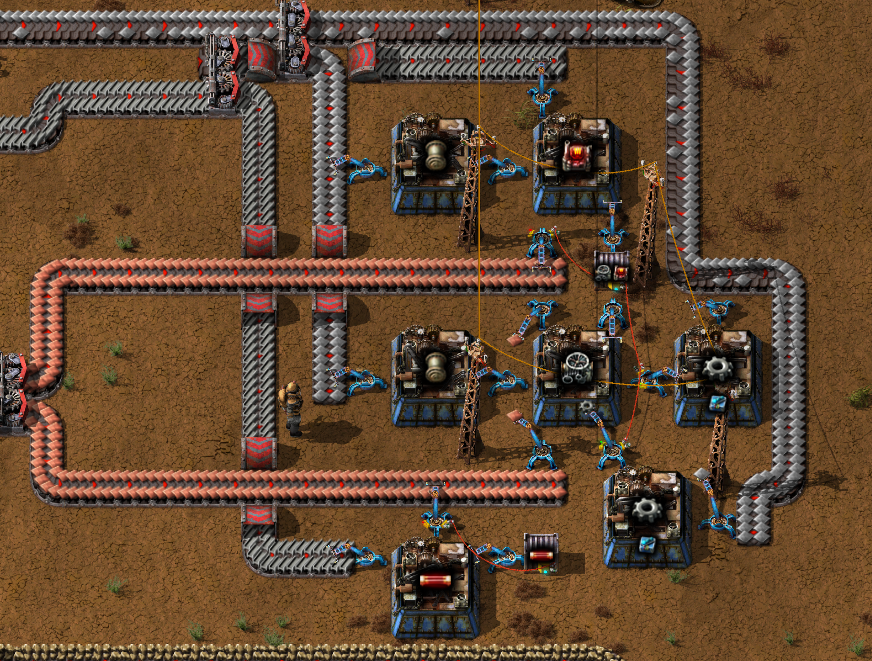

Now is a good time to go through your current factory setup and upgrade your yellow belts to red belts,
but don't upgrade the sushi belt of the mall, it works best with a slower belt.
But do upgrade the belts of that part of the mall that manufactures iron cogwheels and green circuits.  
Use the same upgrade planner as in previous belt upgrades.

## Ore mining outpost

By this time you will probably notice that the iron ore patch is drying out.  
It's time to find more resources further away from your factory and usually trains are the best option to transport ore from a patch far away.
Make sure you have the following items in your inventory by picking up or creating them from items found at the mall:
- 1 x Locomotive
- 2 x Cargo wagon
- 2 x Train stop
- 16 x Stack inserter
- 16 x Fast inserter
- 16 x Steel chest
- 1 x Radar
- 50 x Drill
- 150 x Coal (fuel for the locomotive)
- 400 x Rails
- 200 x Red belt
- 20 x Red belt splitter
- 30 x Red underground belt
- 50 x Medium electric pole
- 50 x Large electric pole

Open the map and search after the best candidate for your next iron ore patch.  
Make a rail round-about near your current (almost depleted) iron patch:

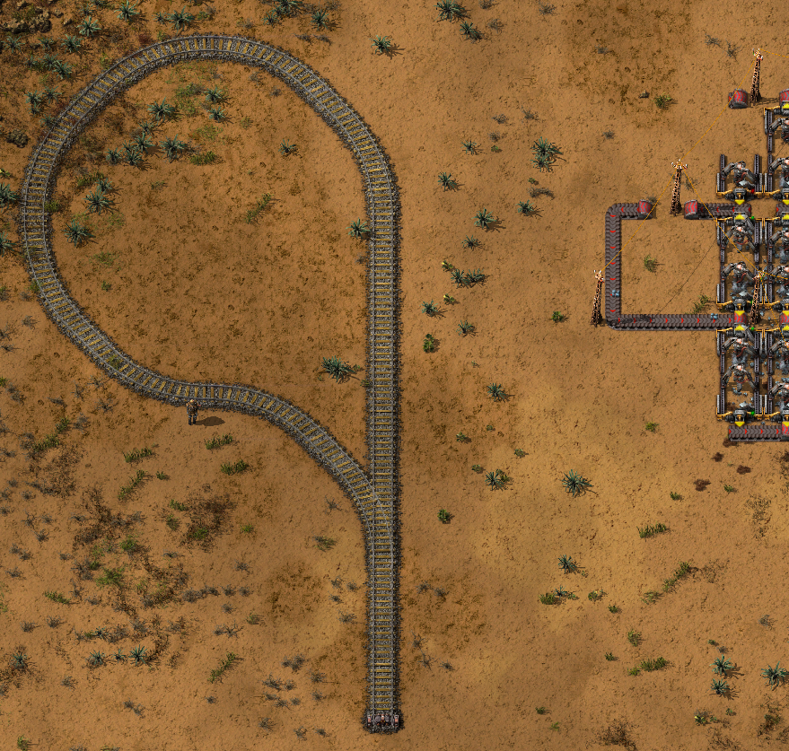

Start building rail tracks from the round-about in the direction towards the new iron ore patch, but make sure not to cross any already existing tracks.  
Eventually you'll reach the new iron ore patch. Make a similar round-about there and build a loading station:  
<details>
  <summary>:abc: Blueprint string</summary>

  ```
  0eNqlWcuOmzAU/ZXKa6hiG2Ng0S+Y3XRRqYoQCZ4Zq8Qg2xl1NOLfaydRXmMac9kk4eFz7utcLs4n2nR7MWipLKo+kdz2yqDq9ycy8lU1nT9nPwaBKiSt2KEEqWbnj6xupEqN7Qc0JkiqVvxFFR6TwMJ3qe3enTmvPd6RPl2tJOM6QUJZaaU48h8OPmq1322EdtCX1Z769c2m7suDDr1xq3rlGR1Siqm798P9oGz09twBEQAQDQHRUCwCKKQ8oyTIhdfqvqs34q15l732d22l3u6lrd219rz0RWpj6+hY/kJHcGMbn8iM+KPd0OjGehL043D9RCRUs+lE3Urjv1Fl9V4kyAjV1ravD96g6qXpjDt7OKq9b4No4+35icajQUpsvUvGr8H+41ULoa4zLFtUlePa3++sP/qPUCDgGSBzOJQ5Nh+IlCGgHADEQ0D8DLQTrdzvUtG5uGm5TYfeZShUVfl3dkJ0v1zslHD8m36vvXwoWwdYCoC5QQ2VV0BCdOn2TRgbtLI4W5kdrIyuCHpF649x4UskYAteXRnTbP+kUhmhrbsU1OKdPa3UR3N8CwqAX9rOS2Ps/7H5TGxyi+1SoszQa5tuRGcf5PwLQx5ioLcMZuiknbKeXbAjkAFaJMEuihksfTQqxDmgUMm8QnWFeVupTuETlcphrpIoVwuAq3Smq/mdq+WUpyVINlGOkhUIO6peCF4gSRIjSbJE9DSKASZ6EoGczUDOLlZHILPZUaEz4w55VAeHB8IBQsMLhZatJpRGClhPwVFyKBcUK45JC4WJOcp6ihcUlWcIYZIFmKsJzDmCJRe0iOgCntI4OOhStmBAxeXXAZUnOQmNqDSHBxgX92WRhRj4AoYyigEwZ+PgawEtQerGeYw+stX8Rob5vEbmZqG7RkYmGlmGYa7yKFcJwNV8nquuRd+6yrIpVymk6UV6msFb9leGUFPJ2AKGPIohB8Unrug5ZIbxz+OHVheQucvp/jFyuaBjRUWcrRYw8JieyAD7dzj4uGQE1iii3skZBTSKmTsbk32BZQByNpOcxjZkBnsxPxn0KM4wicdh8wUNKmpfhRULGFgUA+gFOq7G8xWoUUVYnUNEHtwVysmSeZOEN0TXyfE/jOrqL48EdY1Lmjv3LHdDJ7499U0r1eu359NWdILehTbHYBY44yXhPM8wJ8U4/gPKDDBZ
  ```
</details>

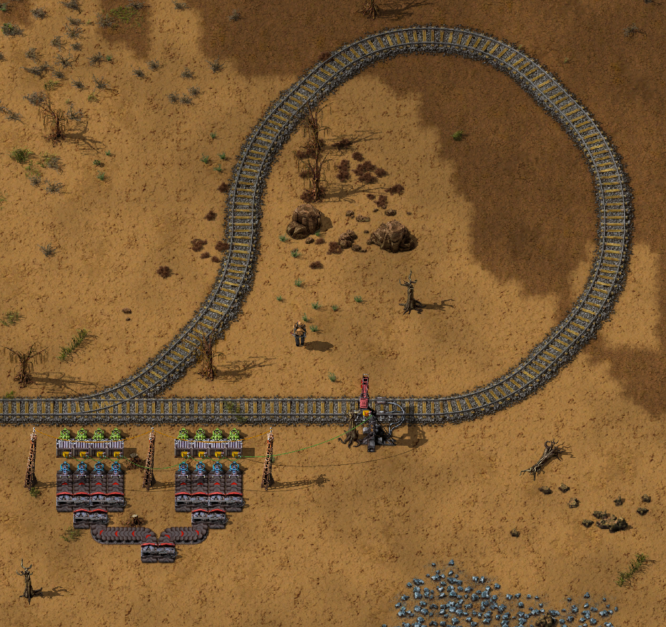

Click the Train stop, rename it to "Iron" and change the condition to: "iron ore" > 4000  
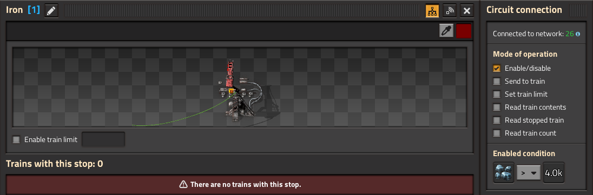

Place a Radar somewhere near an electric pole.  
Place as many drills as you like on the iron patch and feed the loading station.  
Place the locomotive on the rail track and drive slowly towards the factory while placing big electric poles along the tracks.  
When arriving at the factory, place the final big electric pole so that it's connected to the electric power.  
Open the map and zoom in to your iron outpost to verify that it's producing iron ore and that the steel chests are filling up.

Build the following unloading station design at the factory round-about:
<details>
  <summary>:abc: Blueprint string</summary>

  ```
  0eNqlWdtuozAQ/ZXKz7DCF2zIb3T7tKoiknhTa4lB4FRbVfz7miRKUmK2w/glFxKfMzOeM7bHn2RTH3XbGevI6pOYbWN7svr1SXqzt1U9PnMfrSYrYpw+kITY6jB+c11lbNq7piVDQozd6b9kRYckMPDddO7on1zHnv+RvtyNZMNrQrR1xhl95j99+Vjb42GjOw99Gz1S799c6t9G0Lbp/ajGjoweKaXc//fDf+D5MNozAWIIIB4C4qFYBFBYeUVJiA+v65p6vdFv1btpulOYxuHrcXird2tw+H6S4Qxo9XYk7McxdHzZd1rb+yCanQ9gNryOA3pXnc0jJOCUQESHhqKTLwdiZQhIIoBUCEhdgQ56Z46HVNc+cJ3Zpm1T6+DMyR/5BdF/8rGz2vNvmmM3pqigrwGWAmFuME/LO6Bq+yc1tted878EU+xqaH4ydGe6c1L4+AWwaXYHrnWdbt9074LIxQQZnG/8jveUf+WYfyFjbtL+XfXu/46qhY6yr9h+SmzfNp1LN7p238y5mDKwEAOPYHjwQYQYxGKGfN6HIANGrMGaSCUuaxloMhUOnIPAC4Qk2DJJeAl81QTP5jRRIqzhC60ppgqds4ZlKIWCJpXh1A+aUxajfgZRDotR/+hDCHOi976tjZuLiLihfV+rWB5RSRikGjIZwcBBDGoxA184p5glPLgHYsg1PIMkN8es4VlkiRBzJYLjZAzzNEbGFJJUPEbGWVjGPGbZpjOYeUTyZ6BIyAXFh92wAcgxwqUQ4XKEcGnwzMFxwqUFJJ0FQrgXZPjmO5sKt5gRrqARxyJaPh6LVCKL0MFIMEyFAIY0Qr+PDKHcEgKfvZcofaMPEaHtkw8hTMThmQYPzwK396YSNH2IvfcFGawIMVVEPnceFSUqUUGe5llEoipIGuU0gkGG0yhn+KXsMS5Bq3kEg4IIOEftqqkE2B4jXDUTcRmBOTeLClEMwkgFrhiAWjY54uhLF/amxHRfK9VMMZCooy/MUxkjVVBzSkbsnCmoOSVjhJuDfIjYR5+iFMJENLxosOElcQ0vCupfSIWQwsIu0OwyKIuYjSGD9sslbrUFxU/FrLYz3RmFuIiidBivt04XaKu7+7aE1JW3xD97Noe21k8vtm6qnbH7p+fLLU1C3nXXn8VRUKFKppQUVLFiGP4BMij5jw==
  ```
</details>

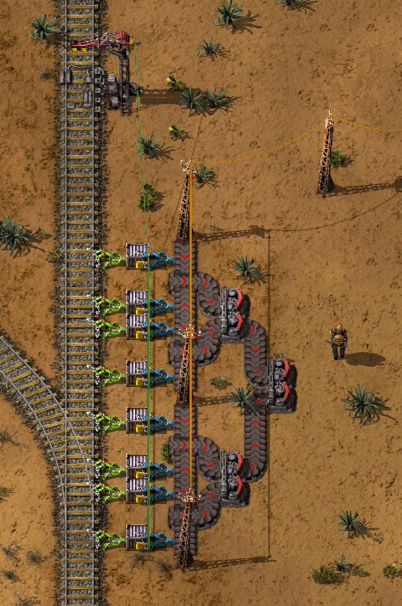

Click the Train stop, rename it to "Iron Base".  
Add the two cargo wagons to the locomotive and then click the locomotive to set up the following schedule:  
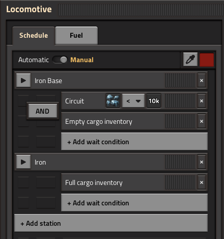

Connect the iron ore output belts from the unloading station to the existing iron ore belts as you see fit.  
Bring out a coal belt to the train stop to automate locomotive re-fueling.

Take a look at the copper ore patch, if that patch is also starting to dry out you should do the same (mining outpost) procedure
for copper ore as you just did for iron ore. If it looks fine you can postpone building a copper ore mining outpost,
but at some point in the near future you'll have to build it.  
Coal and Stone patches are in general not drying out at this stage, so most likely no need for Coal- or Stone mining outposts.

## Military science

Add the following research to the research todo list:
- Automobilism
- Explosives
- Military 3
- Tank
- Low density structure

Take yet another peek at your uranium processing, it's probably time for another refill of sulfur and iron plates.

When you're back at the factory go to the mall and pick up the units you need to build the design below.  
Build the following military science design near the purple (production) science:
<details>
  <summary>:abc: Blueprint string</summary>

  ```
  0eNqtW9ty4zYM/ZWOnu0dgRdRzD/0tS87mY5iM46msuSR5N2mmfx76TgbOzYl4yD7lMQxDy7UAUEAeskemn3Y9XU7ZncvWb3q2iG7+/6SDfWmrZrDZ+PzLmR3WT2GbbbI2mp7+GtbN/VY9c/LYVWHdhWWu2r1T/a6yOp2Hf7N7uh1kcD4UffjPn7yAXP8xnLdjWdrFbT2r7OVGlpJZyvN6/0iC+1Yj3U4OuDtj+e/2/32IfTRoI/Vj9UwLse+aodd14/Lh9CMEXrXDXFt1x7kRrxl8c0usuf4C+X5NxsFres+rI7fKA5qXuArEN+C+BrENyC+AfE1iG9BfAXiFyA+gfgOxM9B/BLDR+E9Bo96h3IMf45dJoUP0teh+oP0LVF8kL4exQfpS+jzQyB/CX6CQAITGiAIZDChEY5AChMaogklMXrGKJDFBB+SII0J5bECeUwokRVIZEKZrEAmK5RoCmSyQkOFApmsUKIpkMkKDRUKZLJCmaxOTG66drN8qmIWu17W7RD6MX5hJp3zJee81Ccmb8O63m+XoYnf7+vVctc1YS7fehfQhnrz9NDt+0M2Xeb3KSEnNs9orj8Bp2CUNPX0npU5a2nqycQ36GYSuJmW4+f8pp/FKTLTD+IUmYlfgn5G3ewZbr7pZZMLE3meEwwJE3kmvALjxmzYsLRIRw4DUhJkpAHPUDCgGPAENTefmQtm7uOD3W/6Lv6cgLQzGi9+1U26/bjbHwoz1wKd1AKeg0rhbZBHVOOl8J4Db3N0NxxnN+p2YjMsgZzzc5yLDLbFgrRK8c5Kr7m8fbeaEUFLbLPticvD2LVh+bjv22oVUhe2X7gpjlnLxrGzOAW4W3T5+F2GSNI6uVeOrbCbVbhk4/hZnBPrqmEI24emjofwtlo91RFUzeasxZvhcZ/r3Vzx+bqol6My6esyCZT5G0QqBm8uvXmDN4WWhniXPqQKw1Cy+KRkCsVKY7djWV2Am+enNu/IlZ9V0yR3zKG5qAa3r2R4+1QDm3Q3etE81Yx4erqco6e5pacjVE8H6smhGN18fJ1G9fSgnhyWnapWk3paaRWJqWYhLcFc4ye7LU5aQ2Liiys8THyPlUYMx+nlF4o65jr10PkiJoukXCr7KFm1HQINUNANm4epwYhvL/A/Iv6uDv3qsPgt1R8ixqb6L4Kk4n95ccOc4erJR/bSHpVCttI+yDV+ss9YSNsgTHxxm+V6v5P44i4LU39xk4WH73Ox/iz/eBLrz8NX0h4R0z9a2iJi4hux/jz/WLH+PPxC2uFi+seJ8Xn6l9IGGhPfS9tbPHzKc3FqxRRAaP1JzZwx5nYBinIlzuaYJmlxOscUYOTFCfU5Ddj0oa3WIe0oK69HIGIKcQkCkeIY2dgpOmlO9kJ5Kb6AX6j+GCVV/XY2DaMcvt+qaYPSg0esC67+hJrEIbiOqdJACjXZoCZzyrhnecOkyQYuuU6YbFGTC9TkgmOyu20yXrSdMBludpaoyZwr6tnpO2Xy2dAQt76cNll95dzT0+fedBuM0HEhdRlob4VDJT/4Jv1txJBqCvIiZx12TT0mn4ezk19xzC/EZRbFG9t08pJIzp1zIVVi1RzeSKvy2FgHD1XnUI2FCcqpBnkUFJ01oHxu76Y7aXQ2AQT37FKSJvurpOXkZDrNigUQT4CcssSbhHbSca/S8wSU0nkvrgAvHaRiCkBniE5BgiuAhENKXHwlnFLi4kvnh7j40gEiLr50goiLD5LYovhO2MXl4pfC1z24+F44B8PEt7nwdQ8uPklf9+AKUNLXPbgCtLTNwRVgpH0IrgArLeRzBRTSSj5XgJOWwrkCSmktnCvAS4vVTAFFLq1WcwWQtFzNFSC+4nIFaGnxmCtAnFOnBNwvjm9C3529OL3Imipixc/+fB/Z+uN9ZCv+60foh+MNt4znnlfOFYacKl9f/wcySfjl
  ```
</details>

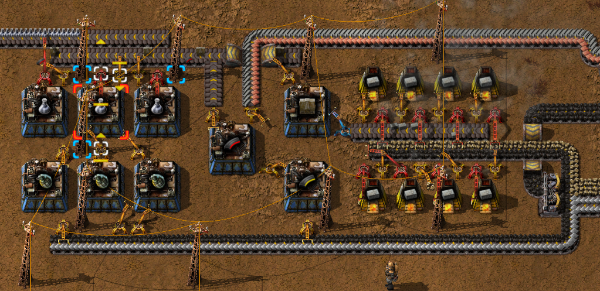

Now that your factory is capable of creating five different science packs your lab setup will need another belt.  
Replace your current lab setup with the following design that uses belt weaving to achieve a very compact solution:  
<details>
  <summary>:abc: Blueprint string</summary>

  ```
  0eNqlWttu2zAM/ZXCz05hi7pYed1nDMWQi9YZSGzDl2FFkX+fknZNuloRj/zUxrHPISkeUQ75mm0Pk+v6uhmz9WtW79pmyNbfX7Ohfm42h/O18aVz2TqrR3fM8qzZHM+fDpttdsqzutm7P9m6PD3lmWvGeqzd2+OXDy8/mum4db2/4dODeda1g7+3bc74/vmVokeVZy/+P1s8qtMp/4IgPhCObl9Px5U7uN3Y17tV1x7cHGT5CdI/7urnX9t26s8W6rws9NMMD0UslTZmqYwhqBiCiiGUMQSNRkvSvWiJvPLxMnPxMhFbycRsrVBbScVWtpqz1MYsjeZgWXxA1M3g+tFfnEk8+Q+nqi7m7eveO3S5Q86hlixUAlGvgjm0zfPq18ZLdb+6xyBABoIZCpBBciJzVSQTVbFQKxBVs1A1iGrQGEs0+yqW3QpEtbDdYPYJlhYlmHGCpcXr/stEFRxUAjNOwPojMPsES3/XHZ6JqmC7wZwWLC0SmnGGhQru0+Kqv5+bYVxNPhj9c9/6v6utO4z3C4z5n8J7/n5ea6exm8ZsjtJ+phz7TTN0bT8yCPUXwrkzVIH7JO5QfPhUNwGXqERdonAM55aJRDoBL2aEEog7WTBHIFGCEiRQKEEBEuh0D3hrYPC8LTh5G9Yi4fK/OZmYFKmg6r85X7GWSRbpBDrwSoXK+yZGrJWXqLylAYNC6QQ8D1B53xxFeQQKz1S9rFBJjVPKRXVEGjSKCoxilU7AKlQSlrfEMlnB8gYroSrTCXgewGIHS60iPG/FsjqiYPmD1V0lyL9YVKiUTncpUEcULO8CzF1U3gQWV2XhZaBq2S6si3SfWEHTqOAJrO4aFTyBxVdTOgFrV9eovEljeaVxeZNeVGo1Km9SoEsmnYC36rDYwVKrE8Qul9URg7+6k1i0zRtY/WC5NyKdIFBHDKx3gaWWgfUOvksb9GWdwPOC0eke8EJk0j3gEaDyFmAtN7i8hV2051YF3LK57icq0L7j93YrCkAIsAMWMoVYOCKKw/rd++annxCOYjeTg6HRYAssZAreSKqimBWMqaOYlt09D4XMFmBHK2CK5fWCogKxrOyW0ay0xB4LCIZGgu2tkClwC0dGxWI13BaKZqjlTycEQ1aBPbCQKZaFExVIWbDSm2QcqGQPRISCUxbwlAGJuGEENtqCQAtOUUFMlX4qUJxTQVno9FGny0J9Gd4JjO74y+ljQnNMl6Gq0PiNv5w+6DPH9j6S9JS/jaatbybZ8nNGu4O/9q09dpvd+OA/PwxunDr/3W/XDxcWUZXSWGEkaWlFdTr9BYftjes=
  ```
</details>

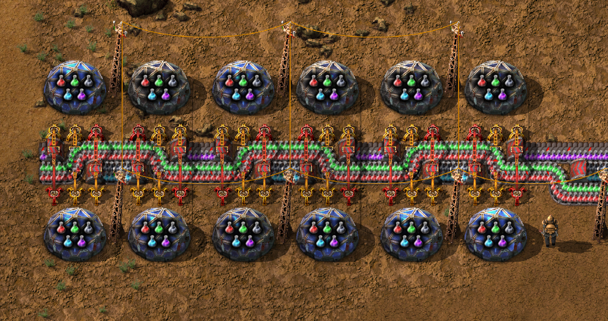

When the Tank research is done, you may create your own tank.  
It's quite fun to drive around in and as a bonus it's capable of carrying a lot of item in its huge 80 stack storage.

## Nuclear power plant

You will need 2000 x Concrete for the nuclear power plants.  
Pick up 8 x Stack of iron ore, go to the concrete setup and place the iron ore in the input chest.

Keep the research going! If you're finished with the listed research, here are some examples of tech that's nice to have:
- Landfill
- Rail signals
- Toolbelt
- Worker robot cargo size 1
- Inserter capacity bonus 3

Your uranium processing setup should by now be close to its goal, i.e. 40 x Uranium-235, so head over to the factory
that creates the nuclear power plant parts.  
Make sure that the chests contain in total:
- 48 x Heat exchanger
- 84 x Steam turbine
- 102 x Heat pipe

Cut the power to the nuclear power plant parts factory, either by using the "copper wire method" or simply removing all its power poles.  
Pick up the Heat exchangers, Steam turbines and Heat pipes from the chests.  

Make sure you have the following items in your inventory by picking up or creating them from items found at the mall:
- 8 x Substation
- 4 x Offshore pump
- 2 x Stack inserter
- 10 x Fast inserter
- 20 x Inserter
- 200 x Red belt
- 20 x Red underground belt
- 10 x Red belt splitter
- 10 x Medium electric pole
- 10 x Large electric pole
- 50 x Pipe
- 50 x Underground pipe
- 1 x Assembling machine 2

Pick up the following items that will be used for creating the nuclear power plants:  
Tip: Your inventory may not be able to hold all the items at the same time, but you can always stamp down an assembler machine,
set the recipe to nuclear reactor and place the items in the machine.
- 2000 x Red circuit
- 2000 x Steel plate
- 2000 x Copper plate

Pick up some more sulfur and iron plates, but this time more plates will be needed:  
- 15 x Stack of iron plates
- As much sulfur as you can carry

Restrict the chest where sulfur is stored to 30 stacks.

Travel to the uranium processing setup.  
Restock the sulfur/iron plate chest.  
Create the following nuclear power plant design as close to a water source as possible:  
<details>
  <summary>:abc: Blueprint string</summary>

  ```
  0eNqlXctu20gQ/JUFz1LAec/4I/a4l4URyDbjEJApgaKyCQL/+1JWYDM2O6wuXhLEMat7mv2enuHP6m5/bo592w3Vzc+qvT90p+rm35/VqX3sdvvLz4Yfx6a6qdqheao2Vbd7uvyrO9/vm12/7Zvd/XDoq+dN1XYPzffqxjxvZp7+1vbDefzJK8D1N7YPh2HyrFU9+8/kSad60k6e9M+3m6rphnZom+vSX/7x43N3frpr+nFBr0/ftY/bZt/cD317vz0e9s0IfDycxicP3YXqiLYt0W+qHyOsGVmquqZ9/Hp3OPcXZB82Pt9eGH1Hweoo2CxSKJtg5yi4NwkMze5pO5z7u7ab5798Cr/w46cwUnho+5Ghl1+xM9D+Ffprsxu2zff7r7vucfyfOewoIccZ5KBBdhqeIy6OoBRHwqGd1UFnhTxs0Ui6aJCjhmdT4/KwSnkY8zvbx/YoWORvuHNIVo2UBCSHIdm0iOTVSNLqAmX9BXoHkTH/giilSeqXkgUBZDVSEZAK45MgSdqackoYtlFgeyW2VXi8pMR2lDfFsD3jTiHNtUFtuoLm2sh4Zmz9Sc2kYBQ2Uz4e47Lg2OlVcy9UlrFdzfhFENsQfvEj9Jx2OXWwsvX8i3NOjWQEJE/4RVCSgfGLIHZk/CKInRi/CGJnxi+C2IXwi5jm+prwZhjX3mi9maTK3qqRBPPyjvGL4Ho9jm2U2uUnFne+Ow27l1+dc7i/ClHr3xeiZmNcmitEfVS7HCtIV50eWicgZXC9wcjr9WV2uQWE9iL0yN1sSR9qtZ4Kkgx62xEkGSy4XOOl5dqNSXF2vY7KBAKi8cFTmQCGHZhMIEANEr0xeeHF6Y0pCEiZyQQwSRYqE4CwY01lAhi2oTIBDNtSmQCG7ZhMANLcqG5uSJobA5NTYOuPaiYFo4iJygQwLjOVCWDYXPWVoUYpV31h2FT1lRHNTfrqS2jLJX31JbQKE1V9YZLkqi8Mm6u+MGyu+sKwueoLw6aqL0hzM1V9QVxnfQYpGEXWV1+CUWSu+sLWy1VfGHZQuwWheZj16aHQ4ctv1tR2p6Yf5pUm1ItAb6bzZXcatkO/607HQz9s75r9MF9zKcVX1BRqHYVSr1iDIJdiIAH7/BvQb6z6OVirZdUrfXhxagpZScGrKSgtrgQ1haikENUUlPGuJDWFoKSQMRV1ShVV26tXOmtTqw12sgiQBGi/i47A1HqT/YP/8rMk9DZrtPLwK1ZRsFWoN9lkmesLPWmnuU5MxeQMJtXMlEwoeCFqpo/Yszv5ptZmIk7oqRv90IczEpQlyiZQmsYxdRMK7pnCCQUPfHojv7V3AfDcPTT9Y38Y/0Zgr5z/Guo7nIfj+TI1OEMmiQOKf8xEnJX4zipAtwxYeMf4It1lx2hrvawnRD5oiX+VfNtJgrdUixPUSEv1OFFwpskJuj2r7nKKBqQfKRHdHjVTgkqTanSi4FSnEwV/M8yLbLfDYXu1mdlg8Jo7OyfNAepDngilD3mS+5nMjgCrdMusOQWezct4eosRlxo0rMVl1tRJogyVlCPl6RdgmBkptyHczhLJnEIHKMi8nxIBdDJIc656S/ESlOHUG1szOhkyARYZRXv/dhkKNJlolqHQ1mO9DAVayyT3FaHAvemQl6HAQeCQlqFAAwhxEQqd5AhhGQoMFWHZlgKo7WFZ2wOo7WFZ2wOo7ZPiQfI7IaihRK4iWXdIs/8hkXWHCAhq/qQQEOVW1FCS3CKo+W7ZtCOo+W7Z4URQ892yl4ig5rtlL4GOTLhlLxFBzXfLXgKdkXDLph1BP++WHU4Etd0BKgpqu1v2Egmd2FtW0WS4vBtLdNAZB7tslkl9HkqG8lxCD65ZX2BLDnIy14Cd5wxSej/GYJtmj4yaxDWaE1QMJ67RDIJTjeYEdVyyvpaQImbWV93S+btMNZoxaWau0QyCc41mEDxQPUMQPFI9QxA8MT1DUIMz050D+S5qHyepdFFPn4uGVgzVM8SWXCzVMwTBqZF0X2Pg1Ew6Cs4MpX/EntXgoh47cuJpW/VYupM2Zgszl45KkxpMx8BtTU2mo+Bm1b5cnu7LibtDVj/TMKEhHTp9P8Wg3ObK8jaXvMFo18w1OGiuwdZUWETfNxUWUXAmLGJOxdZMWET51odF6bi20YdFSb8NFRbBJRsqLKLg6sF2byQheDVULUEF5Qyrh7bbrYm8c5PXnVaAihLI/Gish3a87WS8AZtjFZm1NT+6CjJrDT+7ipJ4F/lOx307SEJ5szOLQDt+ahXl3iu49yL3m+pLu788dlOdT83D9nzcnkdm2/PT9su52W/vm/3liq5r2P187NtDP7Ix/va++TIfhm3gp13RtUfluKusyYmfcEWZzfyEK0qiKCdcQffpaj6jAll3ZgUJcBWWH6lFV6HupIoaqZ+yEAOV5naOSQnssNt/IlUCg+CJKYEd9q7UF055JwlYPWjhhYkYq7p+47UExqTpDVUCg+CWKoFB8DVxFLr2xHq/goSkGH5NDHSQV/NxBQmLkaDOaaKvljqoiYIzJzVB/xGYo5og3/rbPkQVDOrDmqJvCtRpTXTJ1HFNFFx7W47/sM13GQh0dva+HBsiFWAjxnuiAiwInpkAGzED0UfFIN2wp94y9F6CMkyAxaSpuegjaF9VdFSABcG98nqljwZiYxENJK44vSkrRVwBKqrHijOaHppisDGvIOExEtorreZep984V8++Ts21IJOEAFPFZKiEAAS3TEKA+bvkmIQA5FtfDUpmox+iEY1FczmIVb+qRCUEIHhWXoI2kxCMqxcNRB/6knRvqz70RQnKrHCYIn92BajIqVvhIhPkIrNfQSJiJPSWJkpZfbBFli01lOaxm4AzNZSGgjNDaR67DbrozUzaFCzqoTQvbVUWZigNlGahhtJQ8DXdFFGwa7JIUcRr+ifYtMCaez98xkhwXRTwZVJdFMjuXE11UQp2dbi+iyKonqv1XZQsQXFdFHDJXBcFBKe+URHAe96Zj1QE7DL2Wj2iFqQ71Gv1rkGQLnavme9UgNI01IcqUPAVeaQoWLMijxRFbFbkkcEgnteZFXlkqDESgXHu6MuMhHMH7c4kwrmjfGetR5ZVTz1bJiqcpT6lBC7ZqhPLYCU+11ibk0BX7NLJnK6xL2gLza2ZVAkWI6Gu32SBJO5bdyHOtfiEmwkcMa3y9i69xHpZIWio8+kmoyqq7/TNSadcD3bdbq7fVbyZfIZxU+13I8/jz/6+Hv3963j4rxn/3O9e/vdb05+uhpyNT+NrTdGbZPPz8/847yDj
  ```
</details>

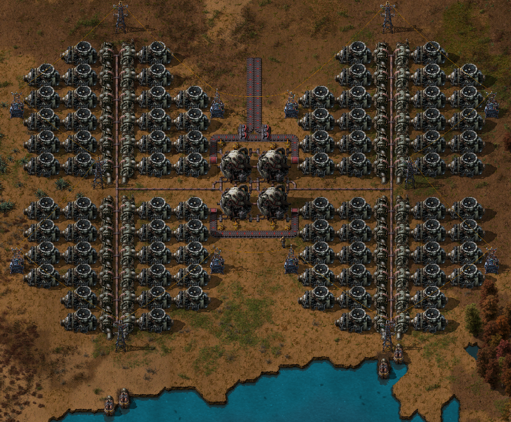

Place offshore pumps and connect them to the heat exchangers.  
Build and connect the Uranium fuel cell factory to the in/out belts of the nuclear power plant:  
<details>
  <summary>:abc: Blueprint string</summary>

  ```
  0eNrFWduO4jgQ/RWU52QVO3YuSLM/MG8jrfZh1UIhKRprcpOdtKa3xb+vTQYItIFy+2FfgFx8Trlurio+gm0zwSBFNwbrj6AGVUkxjKLvgnXwtxj3q79k2YmpXQ2yr0Ap0b2Gq+/9Wynh16rs6tUPuDwJwkBUfaeC9T8fgRKvXdkY1PF9AA0nRmj1G13ZmqsKulGK3fQKwUEv62r4FazJIXy6cJoFinYTNFEFTbNYTx3W93LJnGBWKqijaYgeScAOL2GgtyZGAbMejhfvm25qtyD1Fs9wu1KN0aix1NDLMdpCM2quoVdi1v9HoPEiGtM/eBi865850z81VS0kVPM7zIh9w0DPDC3URk5o9OtSVNHQN2ClyC4U5EjRgXjdb/tJmj0UIaUvFqLEZkwbPD/DJ8URXssvhqUxFj5kIWJnItEpkKO+Z6NJLruIbxVFLbDcxxQxxhSpDwPBMGQ4G5Ci8LRBjrMBeaCh1AJbuDtr/NBZaUhTm7OS2MMWSY6xBSGuOvqMa/NTQnG47IKrA/pgQ0qclbAATVHCMh89pyg9+wTuUTXPKdwjN3HdReZMQVwpcmeK+AGFLX5JgfFNUuSObkRdw/Uqw6FEp5dwVSOYo3wPyg6dXUPbwLxO3YTZE1nIrQcvvQljNTRivJcV6DXH0mVM1TJM40bXf73UBBqvgd1oS/+UOVAmJ0qOqle4TyDgKFKfY8ZmHVMThZxbrZPhQqJw3USO9tfiWnYbWIEEuzoBEjtYErsWaEekpxGa+BTLnylsSk2oDwWqHk8S51SWP6CwKor5ZEschXuULsr++I7jpD6gBHOQJJlPyYOjyH2KBVSZnxRfSb8xJuNLndWsKZ95VcyobTHi3r7Qm/bl5zyMiKDT6XzfaphTJ2PdFF3kvbL6GWGrFmLRZdVrmftms4V9+aYVahZWQlaTGDdtX8Om3236AWQ5r9B2OT2VUNabfdnVG4OhZdRnyignuLxxfHh8zSAdRyOGr5vplaEi5kNCvRwzCH3FisPLwRZuLHHZfHG9eRsec58A0OzafN1UNVDKeZgi4ckggOMOGn7rLc/80KdRp6jmkGU+FLhdOPfon3HTx16tn9VntJ2Qatwgx2004cHswtr1zLQxNhftUOroMBzBt+CAd3Ge33NxZD+S/T86yB/r4E8XHTBqdBAG/RtIKXS2Oca0luVf+D1JvZ13ufdUqaOXc+JDgfJy7tVp/U4/153WvUqeJz4xixo0cJ9xCUVNATj3aX6sCrvXmPJLHi2Vgnbb6EQetWW1Fx1E9NnJzu2DyeWc/TPlTV7FZj7UiIDnPu6cOZYM0JXbBja1UOY7WO/KRoFLzXC6/9W64V5S5YWPGlBOmsZoM14lb9QwKSXOZQOqI0+pR/tC73Tmqc+MljKU3MyjYflMYYuc1GdGi6RIvxb5DOUyPm0jRY0e0tzHe+6MYtLCB5TaQbPYRxmWIclLOFdI68Xfz2HQlBpO3zv95Wzy/srkfaUf6iJHzdbKCcsKmmUpIxnND4f/ADfG/0c=
  ```
</details>

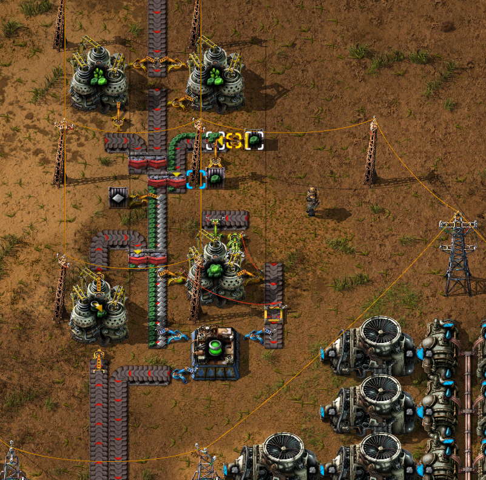

Hopefully the old uranium processing factory has produced 40 x Uranium-235 now, if not you'll have to wait until it does.  
Remove the centrifuges and all but 6 x drills. It should look something like this:  
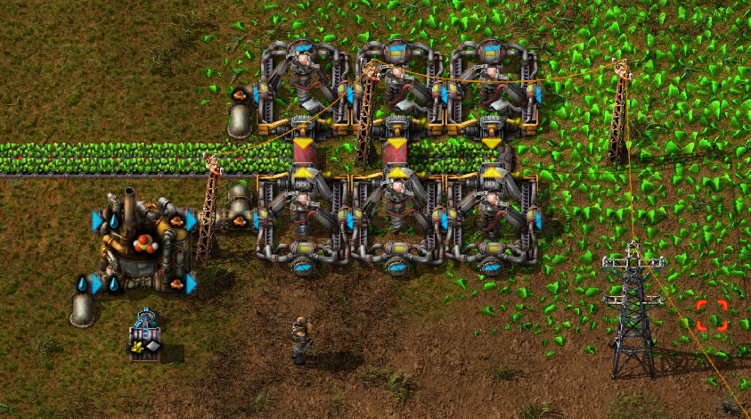

Move all the Uranium-238 to the two chests according to the image above.  
Place 10 stacks of iron plates in the chest according to the image above.  
Connect the uranium ore belt with the Uranium fuel cell factory.  
Put 40 x Uranium-235 in the centrifuge that does the Kovarex enrichment process.

The nuclear power plant will now slowly start up. First the Kovarex process will output one Uranium-235.
Next step is the creation of uranium fuel cells, and finally the inserters will load the fuel cells into the reactors.  
At first not much will happen, only that the reactors will become hotter and then the heat will spread via the heat pipes.
Eventually the heat reaches a point that makes the heat exchangers produce steam to the turbines and now you have electric power production generated by nuclear power plants.

You should now head over to your factory and deconstruct the whole steam engine electricity setup, including the coal feeding transport belts.

## Summary

This guide is quite large and a lot of things has changed in your factory:
- Increased production overall
- New science packs:
  - Production science pack
  - Military science pack
- New vehicle: Tank
- Ore transportation via trains
- Electric power production using nuclear reactors including:
  - Uranium ore processing
  - Kovarex enrichment process
  - Nuclear fuel reprocessing
