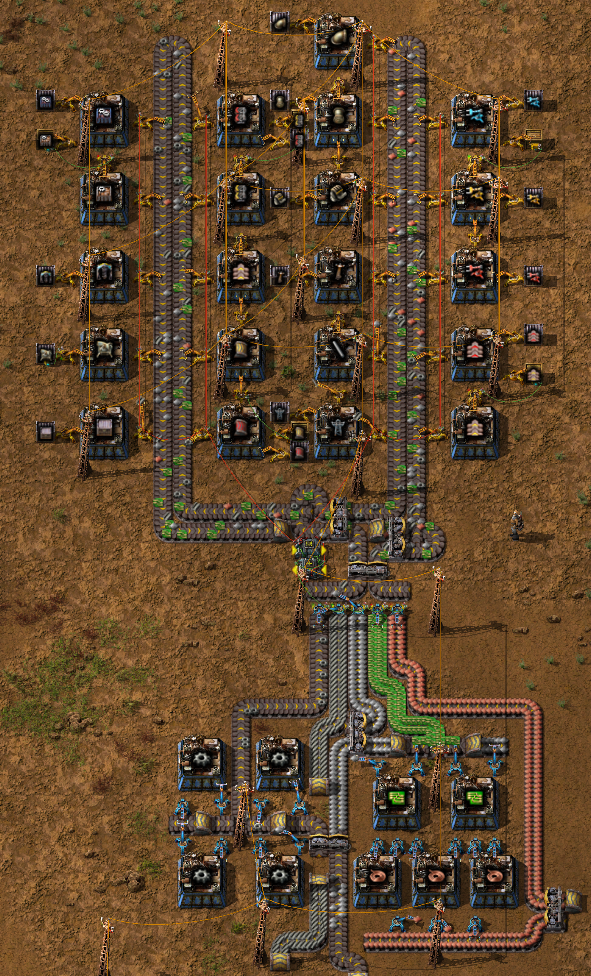
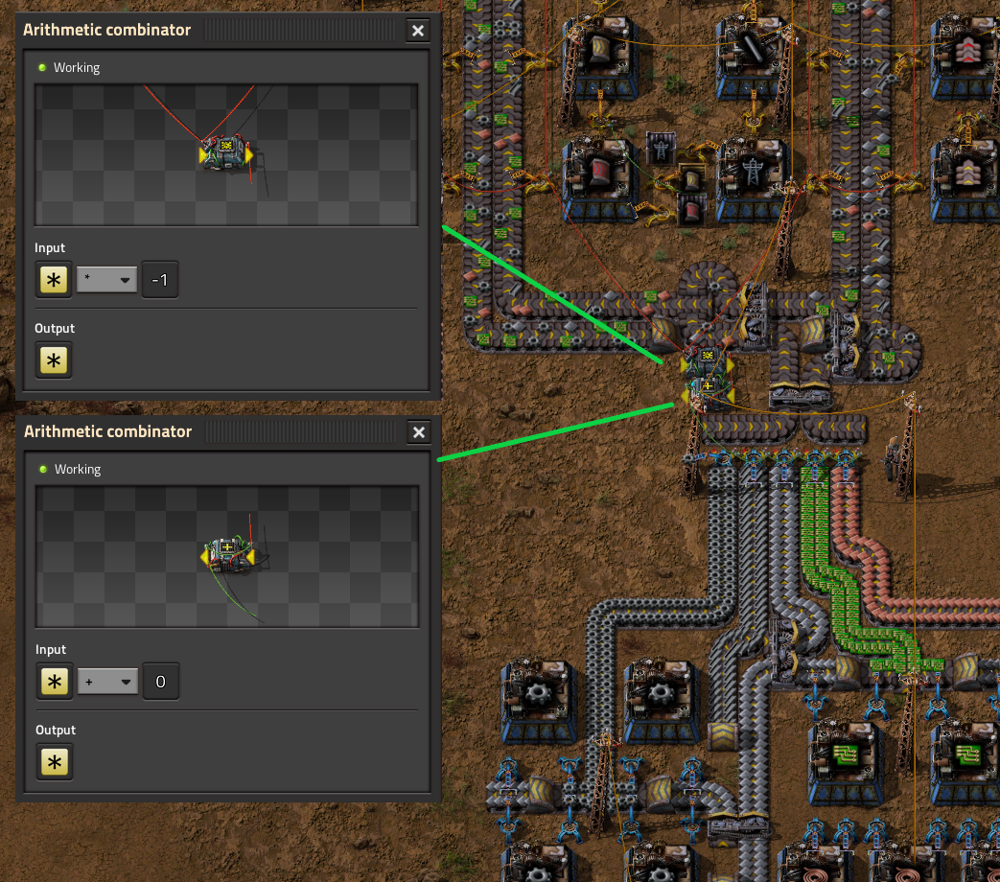
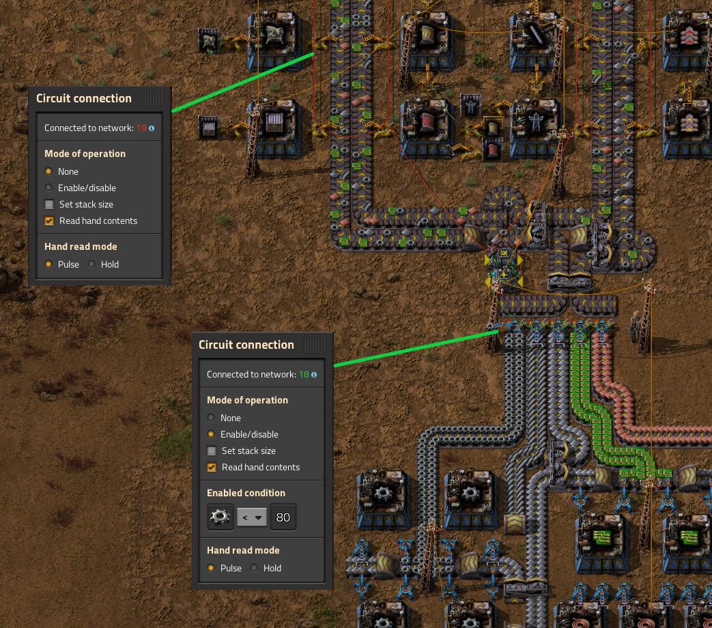
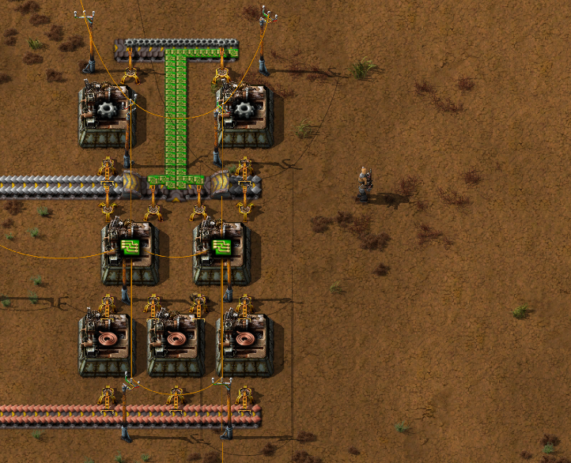
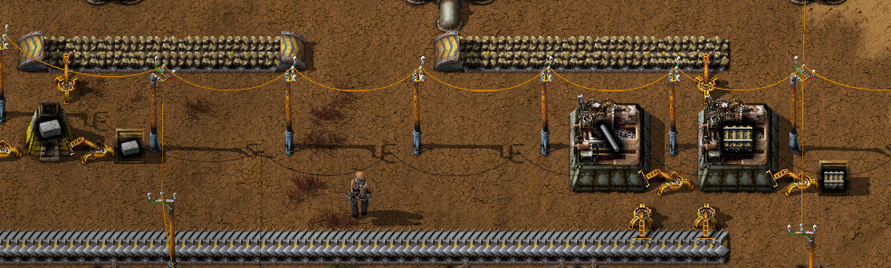
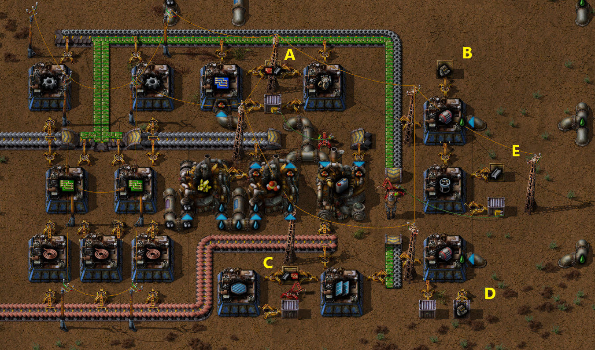
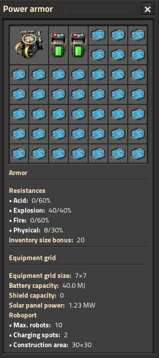

# Robotics

## Intro

It's assumed that you have automated blue science up and running.

The mission is to set up construction robots and a power suit containing a personal roboport,
because it's more fun and efficient to let the robots build your factory.
 
While working on this mission you should do the following research in this order:
- Circuit network
- Battery
- Electric engine
- Robotics
- Construction robots
- Modular armor
- Solar energy
- Portable solar panel
- Personal roboport
- Advanced electronics 2
- Power armor
- Personal battery
- Worker robot speed 1
- Worker robot speed 2
- Military 2
- Military science pack

## Improved mall - Sushi style

While waiting for all tech to be researched you will rebuild the mall using a sushi belt technique for optimal compactness and coolness.  
Build the new mall next to the red circuits:  
<details>
  <summary>:abc: Blueprint string</summary>

  ```
  0eNrNXdtu48gR/ZVAj4m06Op7D5KvyGMwMGSbYxPRDRS1m8XC/x5S1lgtsouqKs149JLA3vHpZnXd67D51+xxdah2Tb1pZ1/+mtVP281+9uU/f8329ctmuep/1/65q2ZfZnVbrWfz2Wa57n9qln8svtX719nbfFZvnqv/zb7A2/zqny33+2r9uKo3L4v18um13lQLnUFoAsS35b5dtM1ys99tm3bxWK3aDMEQENbVc31YL6pV9dQ29dNit11VGYR9+zqfVZu2buvqXRbHH/582BzWj1XTPegH0r6tqtXi6bXatx38brvv/ma76RfucdRvbj77c/ZlAcb/5roFHpfNSUwDRP2BWG/2VdN2vxvDwRDuuW66Jzj+C10ANdNSHy9gzgu44wIdfH2U3677v0W7Xbw028PmeVZYzH4sNjia0TLGnpexw+ewBWgngnYUaE+HdhPQvgAdRNC9QApgkaIfUzvsFKyz7LbZrh4eq9fl7/W26f/sqW6eDnX7sN4+Vw/bbw/bXdUs3/+i057v/7Wpls8Pr8vN80OP0W2ts4q2OVRvR9DN+xr7Hg/6/2mq59xq6u4n69++vpUeLJGlZAPzAECJsJETAKCjeaYWghZhk4wHDM1Z6XgG1tPOCixBG3Ua4l3xVuCY7spk/hAu3RUSZcZrepFrMSTByxyAQdQvitA0gpZEz60pz63VdJwdrxCGkt1U9cvr4/bQ9NFX+7mz82S/ltYCrs5EVGeOacV+t6rbXp9Li2l+2L9iSdow4z7JkjTFPvNgT9Jn7W5IJ2CcThRF7Jm6Y+207qi5N/MA8xSL6hNEEQIxUR1FXpwmfFmcRMzfKNFOSeZvuCbp1LRJfqhwaTGiSTpDNklDMUmnJ6RSykXM2ST/2Ha51oYShtURuZRhvTRVtRnmWM4hOZZxzHitSI/kCahm5APuJycNBpOXLHIDYmyyyK0QNFnkBorpWiXCViRsoGiLn9ix/8XaEhFtsZpo2naUr5JN22tscWJ2n6+tph2gJWUPasquS6iOiUryQdYz6+J780Exe6jjz4AdtCxVQXySjSI0xCfZJEonSD7JyVIVkk9yFJ9k4/36pIh1VRzVJ+WJETPdCJhPctwMSlEciLPcsvLsTPrcplAagC4WlY7iqrLmwwk9V7Zptej+2/MH1re62bcP/K45zN4Pa98u+8696n9Y75adnvWLzf41e+McprHYYXp5V0aHq10ZKGX1TpR/HY+hhBYlWU3hUEvYomysz/EJrWklkkIsS8Hf0CkZnuNUk8RTJhk59s83nmy7P85gLOb9vOG2MGDaT/l5svOuzCy5Ks/s9GA24m/o7Qy1o9q89H902NRtUUG8JPVANy5Ki1AjEXVwaK7Ci5IkmqsISt5zGR7fVLslAFO33VXdBlWMwYHiRpz6TDeSCebHuRGHuZFgeN2V0zHeT2Vj/KC0AYVV0EE0Ox4/cdE0RMNj7UnYounxcd8lNFnW4xG0yOu3jKX5i2sbC0P9AaxfFxJ7MHN6XLQJEhVvMFMwvxIq8NoVd2fUdmTUgJWgUYsiM2Ic0YjQEOOIVhSLSQ4nOhE2yeFEz2tY3J1Ru5FRa6zhFQN7tHPVqCOvMVEQXwk13VAhm0Hu/D2dWtebHuW5qVerUiaWRK16TWKjJBBhk9goSYuCnCvbcTIiNIThk6ycuHCSbGH4nGLfZ5qDN6U8N7kbyvKB8owokePVPLM4p+lLuKF4HDwDwswcrxnlRIHSWXVn/16M9JX2HIIqHpZoCI8pLyhRa5t2JqBAtFeM/KZEDDWaTwBlbihfBwq02nZ/2seo6nmSOdAftbyWLWlQ7HkmEPzX4mqOWc+iSuN5s3xtSNw7FdgswRMyzhJUkVnCmvsjCAyyFYu1yUElUSjC2H4gi+80YiLIArymgcsiPEZUBMOsY8398QaGSpQwJcqIteRC9poVgmNWsjSHAczJ+90ZdxyVIk6h5yLrMqPGLZq+4yYi6yzTfIWWJSk0X6GZA/i7M+446oegJDzQfK7iVePWzFF7QYBF2Ftm7TDOjY787Tmkcm6kbyD+Q7pM/5rl87Kc72kR1V8DTZGDCFzRwEUEQo1Qf0DLMhWE+wNGySvY4ekdurS9eX/FDK1hwQCziMUEkZGH+ZNaKFYAXb2PFPpA4hXnlTFN8zJiMbv4Hoq/brabxb6tn/5bFrwThS1U/LJBMKqHQRSoiFKWDYZp9m2SvPwdHmH53djCG1yKH4wy3mjxOUgU3zwYkSieYDW7ND1JhTyFBXscLU2+8mZ4dTckZr7LH0h/j3XZNNoNptH/5E2jAWW1AIkVbIz8+X92qtaPnwe5WkQTfiuaGgOJCAJWlIlApIGLpsiA0GvAinIPiBhc4lXzY4n+4oS/H0IPtQjN+J3i1cj3ZzMwqm8SajNO1HFGNc+J5seo5jkjieBEi3aieTLRokl0ZBvv2Gb0qNWScJvxfOb6SZD0MBcCunzg5TDjMyy/2h5vKHEHV3HkSVBxLREnGUjkBvCivjR4GjiIgg1C8gAv6kRDwOCMfDx8ku5w5HiaNaKdEW9vqK1doTIgFdje8Qrs08P92OS2sNMfx7oE9MUZyOjJ1BY8XLnbB3zgteCBdLsP+MjrKOCanW7oIQzU7LF+uT69h6Dk4/uSLcGJaBH8XKty/yXI0hNMZkGWnmC+KsjSE5rTDrL0hOa0g7uhe+G4DBYIXj62L2pO737LHHQIgTe0LxzHj3aL42vPfpxTdKhTzMjE5BaMu+IUQ2I2VBzJKZKIu8ZMwf7ibNlaeoUZRZN8oFGIGAzeHJzG+Yki6h5gtBgGozeHw+hO0TH7FO7eaq6oCrSDy9/ovmX+fcnjP0HVzPOvODiJhO5+PK7lgXd3ANVVRCasJfWrY2JfyXBCxp1l4naS7s6rOVXoAUj1MclyOcx5JFkuhzmPJMvlaE45yXI5mlNO3FbT3bm9pOiEjOTlLAcoXDY2QfOGJCIIAI2jk0RvuAONo5NEdAHA7khTorfaQWNwDE8AzEfXHNKzngD3RXBzQwmsy4WMdkXt08qKHBx6hiIiAH6GXuTSaPfmKREtgKogsukY6b4TrWR9XBKhQcv4xcSdg6yPixBFNIdR7Nl7ZdQhgQ1uRTsHkgMBJ9o5EZwxo05ssTCCYWSDRxE4USxJJBYaOIdqC5diKcIB3kyfLHNUoXb43oza7A5t+W5cLdo8UTKMjFqxwa0oyisauBOBY64wI7F+3Goz2Z0Hyh4ZIdKyBRA5WuhIWrg9tKgaMrjwjqspnGtzLRscKEebxzeCMzSi1/aoOxa9k4/qtpElqZj747BVI1erM+7qsqnb13XVdnn703b9WG+O3feCdZ9WUJFYM5+Bz3OC/cSg4Pe6aQ/db85qdPwXi2r5dPxIy77qYR4u5gVZHT77R/eX75bFxX6jF+ijHo/uv7VSbAgehTz4p91CGu0gjv5gSDvRFrtBRGfsYfaBUllbP/1AF3B5on//jBMttFyO84rTSRV1wNP6fJpDuz5788KBFMETxeG63GyLd+2LgoJKGJyotUl8ZKslPhHfq7n8JtNEz/Cc2yj/82/q6t9jeKmWzeKP16paXU5JoxpzpMUtSKrjGvoh7DVindGsr4nUfKZI3ycZu9WyrS7Fqd1PF6c1I/kFVH6MqJ8JMNDMx0uSeSp4IJ+8/XRjKhy8//l2NJqEaxvRg49k8bnPFN97U3e76bOJd5DBGxufIMYwFKNDIy7nKm97qeLFT8YoUQBH4YB8yP4zD/lpu+vSrqJ7/ITjRW3Ciao/Rbr1Srsb7rlVxduSzFz78leeOPx6c7lKEU7UlMHhvGh3FoMLot2hcLIcGn1YmYPA4LzMQWAPy2CQ57tD4WQGhD6siBiA7477ln6e05cssDNpY8oTRC8zGWzk52WZFDaQ5NwCbQhwUQSHPqyoJ4nuLshMBttdkJkMujstgkN3JzMZdHeiHqMi3Zqhg2gsjj+6aCyuaOwDzmXD50GWIn3qRwfRCI4KnkTgWJs4ioZuxL0y6LnZ3IoKLmKnKKz9zrlh1xDgZCkbekyy+EMbGUcv8lnooweRg6YNXaIsnUPlSmqCZg9NmTol0YeXUXkm0ZeXcThZUodJMImmYIo2Z+KwPSNXlRLDphIb3It2ThQL3cKcYu+cbmEO2OD06OU0E9wwuJXOsMFBBI59xjLjVhJfbf2wxRQL1xZdtPsLyxlB1pAStnn2pUvqps07yeYjtnlJ7YWLQtKtwPcmqbwSafhlGHzKDBvbaUagJPebcTAQBHXiY2fsyWsbDQMlvfqlZ8Ph9viJjV8nmBmQlG5UGTmyjBJXRpI4iFob5yLShAuh6OCBPEE5hz1co5MgiBJPK+NJXle7c/yfUjucUWa0JO6hB8igSbrrTkiTB/BnnnUivdZtNHkQfSYXJ4/tk2xf52YDDuYl0RBFk3CRU8DQ6FNI4B5I4jhbfbFVip5zyI3mqiAMSNCwQzLcZDELNr70hZXBPLawohH31k8rDj50Z+cmFi95MewbPDOXJnw4J3FC6FF7CRp61EHg0iwGJnk/JzlSuMzoY3QHSXoN01hOgMvqotLbmNcNn8E4y56E9Iq1sdwrdjMfa8dmZGLxuyyGTkTL4gvxLKwkPiATQMO5VzIxFTJjJ9FjD2Y5GRuJ8/LIlAriqT3na/TAlQqpwWmuiIPDY9HMHTpRqMQ0zGlBXUozBWf47BsqtBUUqURoSW1HhCZbXBayidBBUIwRoaMkXqP6liRomJ15Je8Kan5jjf1R9MzTSZbTshRe5yk87ka9ZIKXDHYUkgFe0hga+wPjDpP0iWz3tHwsXy5nMnIJca0oX4v77bvMXNlriQwXPV+R4WLnG0TVI2BoIAm3KJpkUJ6wwUUQWRmKZgUxlfRZARPogS9yoSWBjwgdJGqJHr3IZIg7pWSWzp73SMgFI/dezHOVEGOhXurqL6ztECU2FrG+JoeMYq6jGcE8JNLa3FEyR6BiS779TMX24o5UUTWMmWPldJRMGaiPEQXzECq2ZOhAxGZwWs4+j4otGTFQsbWAcFDC/jp/f+nhy+xxdah2Tb3pIVbLDqv73b8P+9f6b+vlqn+j9Peq2b/3hCLYkHSw2nS24d/e/g/jnt/1
  ```
</details>



> [!NOTE]
> The trick to the sushi belt mall is how the two combinators and the provider- and consumer inserters interact:

The upper combinator multiplies what the consumer inserters take from the belt with -1 and the lower combinator is basically a memory cell.  


The provider inserters sends what they put on the belt to the memory cell, effectively adding to the current value.  


## Power armor factory

It's time to build the Power armor and its accessories.  
Start by removing parts of the old mall, it should look like this when you're done:  


Remove the engine assemblers from the old mall, it should look like this when you're done:  


Build the Power armor factory by re-using some parts of the old mall.  

> [!IMPORTANT]
> Make sure that the Power armor factory is **NOT CONNECTED** to the power grid!

The chests should have the following contents:  
| Chest  | Content                           |
| ------ | --------------------------------- |
|   A    | 100 x Red circuit<br/> 20 x Steel |
|   B    | 20 x Engine                       |
|   C    | 82 x Red circuit<br/> 410 x Steel |
|   D    | 20 x Engine                       |
|   E    | 20 x Steel                        |

<details>
  <summary>:abc: Blueprint string</summary>

  ```
  0eNqtXNuO4jgQ/ZVVnskoTnxt7f7Dvq9arQBuOlJI2CTMbGvEv68DIxLAJqfc89ISNDkul+vUzQU/k3V9tIeuaobk5WdSbdqmT17++Zn01a4p6/G94fNgk5ekGuw+WSVNuR9fHdoftkvLbt92yWmVVM3W/pe8sNNq+Unb9a37QNq16/bQdkNq/z1Wh711EkxIOYC0LofBdp/e5wvg+b6tyy49lI2tvRj89LpK3FvVUNmLUs4vPt+a435tO7fdK9TQlU1/3sza1oNb4tD27rG2GRd3UEJ8E6vkM3lJJf8m3BLbqrObywfOW71DznFkRUMucGRJQ+Y4sqEhCxxZ05DlZJbVwaZDm+669thsH5EluyK7szx5sBQs5QwLklLjyBkN2eDIBQ2ZZTh0ToRm+KmJpVNjONUkkcQM59oISILGySaJDoLhbJNED8EkDk10EYzAPqKPYDj9FJHYDOefIjI7x/mniNTO8biniNTOcTaqJ5ThPuiJjWXf2/26rppdui83H1Vj09wTS6YF2HkBB19d0oiubdKddcnDjw9r68S32kTQfl/WLsGonXBdtUkPbW09i01nUJwXa2y1+1i3x27MPIR49a0xMbVqetu5ZOhp5lFAapIxqUfhd665igHLA2CaeICzYBhxgAZRrqEpt8hoVjFLFDxWwYuVZD7DKBhVU/emPt/HTG+Hrt3Yvh/Rjk01+PRW5IDeZusFLKeY2Pqjbbe2STcftn8e3gJ2U3BEInkDs5xGI9ybRZoHUOkDlcRzU0ELf15lPa6sgO3MVgudmo5x3xh1TAx0jkDzDLQ1tWhrnMU4vCwAFlUFsgDYRKi93VbH/aLvUXe2deN7nCfT2coUPvfDZ7FvcO4VoG52XmHTNs3loPrxI2z8s+usbebFd7V1B6FPryfvLgWN6xlCSy5pXM+galnF2DOD7DmKhRkEjURFtWiMIqM6uivkGHLvtDtze1ebts1uhApFKUHg6TUGj80FoFlBYG1OhCY0bwoiNBIkp4z48RR81iIEMQkWd/g3Lsel1JKtWGZ8PkdMHD02W9tdGgKL3TiPclbXZmFzOPqNh5DVcuIx6AiXf1aWD8zEgGk/mMwiGofYpiUjmol5ZibO6IpQZJJ5RCfxcRO+ICELigEaxADb4xCwQMkjeo3gYUARNKM5AikjOpigvCqihQlC64gWJghtIrqOGLTKIrqOIHRM4/XRQnz0UfkN9FNZA+5OFRGNS3DjnEBuqb4UXZTAlayfZEU+aLmkZLOoZIVDBCKJmmhVty7t+yidSrcpUnc+KpSfq4aha+u3tf0ov1dtNz61qbrNsRre3P+2V6j3quuHt69dT473o0M5XpZm44v9oezKYVwz+Ss5UUoYzgMljDIEW1P51wKJzohVobr3RvcdKcbUiglvW0ozpHggOg4d0zHGopYuYqA1BM1hkitDVAjuPzSn+Q89+Y/3sh9SqFJQfi+gFbUdPxmGuO11XUy2bZzR/uK919Q1LLy8EX75MA2MrGnIhlonzxLLKCUZhm5llqcFTthMzNx82H21cU71UI++81lmJp71n/tj/X7svIKT21vi7igeW+tjrbli3Hv3YqCm8rSGRKhraN2roOIlrnhFUbxTZrlxwcu3JiEvCImtlyD0IoRZgFCLVsuyDNbedN17z7Zfo0mJdwEoDObLgua0cAqZIMuigh7kzVhGSaNn6NJjmktpNMsEqVUZVrOM71XeWcV7/Tk+O2aWQ/rejaDeFaHLGBNWj38eR4O3HDq7QfZiGaK3nfWXuLdl4/w3096skc0mifAhLY8782KzJZ/DbgT3YiyWrmIZo4iprME9cmq9xcMryN9db3k5MSuz8vs6609ancWYDBRajAkazzjkQGdDTk9vv2Y047TbL3eiwS0pIjF1/oyYOvMzUkeP0oi7e+pNe3AVd7op17XfGTITUXNAN8psNiKFVwQgNHUCY+YgqRqazUzh5Qe4jSJ65Ia+DR5ReoDbELiXL0Jjoou9s3wZI6pXDc2jsFzHdJRBbBPTUsawiwyPniG9FgxvHgcx8oiJWnSPUZ1pEJsv7V0u711EzOWi8smIwVwUmza1BHoLyhBTRpXYxFVAebgCCjd3Gf/CmAX7HWMWjDAPNfN4gakRRhiImqFlITRycLt6Im5ug1vom0SeRaG+kboRHvg2gKB2v/TdQd+kfWMx5m/hM2wWyoTl9+bMs2GohWlPvXysmuYUgsZmqORhgHl4jULAiagqiJYxG3QiX/Bkj5YxWlqgKBDEdhSDLENEtaOgMTkmeAx2hmGLmAseUCcy5oaHYfaiIgbjuMawdcT4GoptIqbuQGyZ0UtQDt0wMhnzFVJU7DxiTA3FLmCVKKpKeMTUGiq2iBhiQ7FlxPdfUWwVMbeGYmt63Y0epYkYUwPFpow5ZVTsmKyVB8ZdmMojxshQSYsYSU1IUlpyyqHBSDYbaML6z1OSxw2mBbDlKvXyYUElpVxWpcZEUnJZJGjmXhO5OZv8eS7gss40ix3z5p6r9/Olu869OeZs2Ic4Kexdabxwel1dLiReZj+EsUrq0pHIvff3+DMXf5x/5uKP93IztN2n++932/UXa9SudDG54nlRaCFPp/8BV5q2XA==
  ```
</details>



When the Power armor factory is built and the chests are loaded with the correct amount of items, connect it to the power grid.  
While waiting for all the parts to be manufactured, go to the smelters and the drills and increase their capacity where needed.  

When the Power armor factory is done manufacturing, check that (but do not pick up!) all parts has been created:  
- 1 x Personal roboport
- 40 x Blue circuit
- 20 x Electric engine
- 20 x Flying robot frame
- 41 x Portable solar panel

If any amount is wrong, you may need to manually distribute materials stuck in assembling machines.  

Pick up 10 x Battery stuck in the assembling machines or the plant that creates battery.  
Disconnect the Power armor factory from the power grid.  
Pick up the parts from the chests and start building by hand:  
- 1 x Power armor
- 2 x Personal battery
- 10 x Construction robots

Open the Power armor and equip your new gear:  


## Summary

By following the guide above you have now a cool Sushi mall in your factory and you no longer need to build
the factory by hand, that will now be taken care of by the construction robots living in your Power suit.

:sushi: :robot: :sushi: :sushi: :robot: :sushi:
