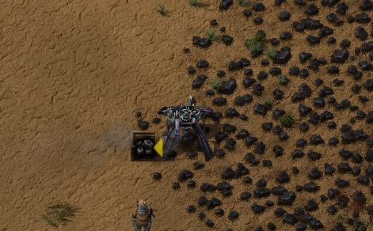
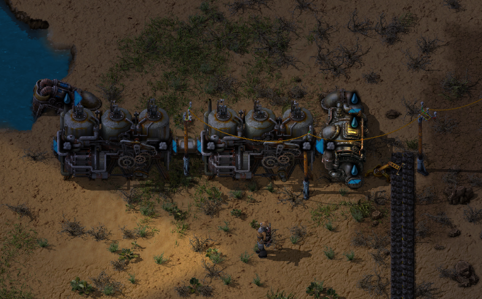

# Start-up

## Crash site

The game starts at the crash site.  
Collect as much materials you can by "mining" the pieces of the broken spaceship. Even the big ship can be mined.

## Continue mining by hand

Cut down some trees - create a wooden box.  
Mine some rocks or find a stone patch to extract at least 20 stone.  
Mine all rocks you come across in the near area.

## Coal drilling

Place a drill on a coal patch and a wooden box adjacent to the drill.  
Pick up coal from the box and add it as fuel to the drill.  
Get some coal from the box to your inventory.  


## Iron drilling and plate smelting

Place smelter adjacent to an iron patch, add coal fuel. Mine some iron by hand, place iron in smelter.  
Get iron plates from the smelter then create a new drill.  
Place drill next to smelter, add fuel to smelter.  


## Copper drilling and plate smelting

Go back to coal drill, pick up all coal from the box.  
Go back to iron drill, pick up all plates from the smelter.  
Create a new smelter and place it on a copper patch, add coal fuel.  
Create a new drill. Place drill next to smelter, add fuel to smelter.  

## Electricity

Go back to iron drill, pick up all plates from the smelter.  
Go back to copper drill, pick up all plates from the smelter.  
Create one of each:
- Offshore pump
- Boiler
- Steam engine
- Underground pipe
- Regular pipe

Go to nearest water area and place the steam power units.  
Put coal fuel to the boiler.  


## Researching

Go back to coal drill, pick up all coal from the box, restock coal fuel to drill.  
Go back to each smelter, pick up plates, restock coal fuel to units as needed.  
Create a lab and an electric pole, place them near the steam engine.  
Create 2 red science packs, place them in the lab.  
Start researching "Automation".  
Create 8 red science packs, place them in the lab.  
Create a radar, place it near the steam engine.  


## Create transport belts

Create:
- 2 x Assembling machine
- 4 x Inserter
- 1 x Wooden box
- N x Electric poles (for this you may need to cut down more trees)
Place near the iron smelter.

Place electric poles to connect the units to the steam engine.  


> [!IMPORTANT]
> This design will consume all created iron plates from the smelter.  
> If you're short on iron plates for creating new units you can always temporarily remove the electric pole in the middle of the machines above and iron plates will pile up in the smelter.

## Automated boiler fueling

Place transport belts from the coal patch to the boiler.  
Place electric poles alongside the transport belt.  
Create two electric drills, place them on the coal patch, their outputs pointing to the transport belt.  


Create an inserter, place it between the transport belt and the boiler.  
Create another steam engine and a regular pipe, then place it adjacent to the existing one with the pipe between them.  
Remove radar and lab. Place the radar where it's not in the way but still powered up.  


## Semi-automated red science and research

Remove the coal drill and its wooden box. When coal fuel is needed it may be picked up from the coal transport belt.  
Create a new smelter then place it and the former coal drill on the iron patch to keep making iron plates.  
Create:
- 3 x Assembling machine
- 7 x Inserter

Place the units to automate red science research. Put iron- and copper plates in the box.  
You may use the Blueprint string below, click the link to make it visible, copy the string and import it to the game.  
<details>
  <summary>:abc: Blueprint string</summary>

  ```
  0eNqdlMtugzAQRX8lmjVEMa8QPqPbKqoMjJJRjUG2aRpF/HtNHpQ0VgJd2tac6zu+nhPkosVGkTSQnYCKWmrI3k+gaSe56PfMsUHIgAxW4IHkVb/irakrbqiWvi4IZYF+w4tP6DwgWeI3ZKzzXlIEz0cVQbf1AKUhQ3i5xHlx/JBtlaOyyLtCD5paU3+Fnm/rk2AZe3CELF3GXa/+pzz4vb3WWOWC5M6veLEniT5z8JIrj60s0AOFBTXPzT9ohoMmSY3K2L1HneiqsznLlGSFLseBgxjNdbG6uQj+7SKe4oLdd2tkI3IgkynI24MyNqUz6wF5qOsSpV/sURsHNhxjHaB0AOmKC+GjsLKKCr+pBT7jXZxLpN0+r1vVh5hFW4fCZk4sHt0nDiRbzQ3GwI/ug0HKRmKHXPmHPaJwBYKxWc8XTnk+FkxhhuM0uyiTflx8/ydeZJVFMwMxfIX4MRDpth9z5zmYjYav18802+wM3rBcXD/kQhuuTNvY0y9U+tK6lEXrTbCOgjBM46TrfgCk8+Bk
  ```
</details>


Start researching "Logistics".

## Automated ore smelting

Create two electric drills, place then on the ore patch.  


Create two more electric drills, place them on the coal patch in the same way as on the ore path.  
Then create:
- 4 x Smelter (for this you may need to mine more rocks or stone ore by hand)
- 8 x Inserter
- 2 x Splitter
- 1 x Underground belt

Create the following design and connect the ore belts and the coal belts.
<details>
  <summary>:abc: Blueprint string</summary>

  ```
  0eNqdmNuOozAMhl9llGsYlRwI8BL7AKtqRDvZbiQaUAijqaq++4ay07LbZBr7quX0YTv+7Zgz2XWTGqw2jjRnove9GUnz80xGfTBtN59zp0GRhminjiQjpj3OR6Prjcp/Tda0e0UuGdHmXX2SprhsM6KM006rBXQ9OL2Z6bhT1t9wQzjbmnHorct3qnMePfSjf6w380s9itavIiMn0uSseBWXS/bAohjWJsxid9eObdflqlN7Z/U+H/pOBYDiC0grD/QPK334vesnO3stt4E38EjwHtnyixwyVCCcnv+FWCWGVYVZEhbAeR3iAWRZnfEqFMUqNYqMfhfFGmgtfLmLTXpw+Y0uw8EtCgysjMDuutFmVNb5k98luLx6/K6tD9H1hjIEZTBomQSFa6YMeixSjKuAxpUwaFoYJUaSsaypMLBY1tQJ7q5U/RBDGqrgGxhUJkELcI0IZg1N0QljQI8ZDJrmMU9eaPa01lCBgUWyhpaYwiUiMImB8QgMJQ7x/3LwEHrVXYZOu3BlqFf2PUWy9G6ykotIKTnsLpfJb+Lswfb+9zl8sfvv7rCf3DA5EsJTTDpFMoAxDCySAYxj0olFYIB9mfgH9nyBABoqgWiAoiQQDdBXBUTXGOmylErKNxDp0nAu8PTd2jzagOyjmDqQhgZoiwHRgP5EgWhUt4qImKMGosh0ylFbuch4yiv0eFWkzqcYVRWRyVJsMLDIaClwHepq261DaRNpUAIjqcXUbbZ8FmlWX1Ey0rX+aX/uh1Uv49GDtDm8fBT+yoey45LJVcFlTSWnjFXC7z7/AFOOqi8=
  ```
</details>


Setup this solution for both iron and copper.  
Make room for more smelters by extending the belts holding the plates.


## First mall

Make sure there are 75 copper plates and 150 iron plates in the wooden box to create 75 red science packs.  
Start researching "Logistic science pack", a.k.a. green science pack.

Increase electric power capacity by adding a new boiler/steam power setup adjacent to the existing one:  


Start building the "mall" according to the design below (make sure all wooden boxes are restricted to 1 stack).  
When the mall is completed it will provide you with the essential units to expand your factory, such as inserters, transport belts, assembling machines etc.  
You will no longer need to build those units by hand, but instead simply pick up what you need and the mall will re-stock itself automatically.  
<details>
  <summary>:abc: Blueprint string</summary>

  ```
  0eNqdXNtu4kgU/JWVn83Ife/OP+wXrKIVIVZiiRhkyMyORvn3tSEKDu6GOvUUJQrVx+fS51b4T/W0fW/3Q9cfq4c/VbfZ9Yfq4Z8/1aF76dfb6W/H3/u2eqi6Y/tW1VW/fpt+Ow7r/rDfDcfVU7s9Vh911fXP7X/Vg/qo7354fTi0b0/brn9Zva03r13frtQMQgMQXX9oh2M7zD5mgI+123ZzHLrN6q3rp+Ofh267nWHYj8e6avtjd+zasx5Ov/z+t39/expPe1AlDdTVfncYP7brp8MnKP/D1dXv6mHl3Q83HvHcDePhp384PeEVssaRgwzZMDLbETmDZXGsJJPS4chRhuxhZKdkyAFHbmTIEUc2MuSEI2sZsmpwaCeExuPOWSG0ZqS2EDQeeU4Y0woPRCe8iJRjpMYU4hmpMWhBLApvJiUIRuHVpBIjNaQQ3TBSY9CXaHwf8+bwMuzGnwVw39wAr7/SdL9/n8qI5Vl4eHrh7a3x8PTC61vj4elNWT82B+0YaEzqS3ge9tvuONVXS9BZVgAg8bD0wpygIwONOXiSOLhFHHz3fix4uMED1Qtzm8HTppcWlYK4FCYgYxipIcMay0iNQQviUpiADJ42vTABmcBIDV1UJjJSY7q+xOev3e657Veb1/aQAQ7qCvhpPXz2qNeNDR6FQZhnLB6FQZhnLB6FQZgMLB6FQdgoWDwKg5M5nXUMtIOg8SgMwnvaBqZFN4UWPTJgugB2ibTD23q7XX1NUPa7bXuzGzWnJ+/b7uX1afc+TOOUpB9znX9zezJ0q8VTp0NG5XbnMnLY9auXdj2sfr227TaXbp1aDpFudXoG8Q2nmZ6pYEBHtY0FAzqLPG4SPq4TWmxWPxMW8zIfnPUBGR/0TZ1i1g0DU1hrSF+RgcZMkaSm8CVTFMayy3laI7SHv2WP0bre1apJOZt4xZQnkE28ZqAhm3gDxFxQQlArNPQsK18Z+qu5yx3jZMadnZIPNqVs1rKeSdSYpgIDjTkNlVtV/mr2iQFr8mChYZJGCUwxYIXHDJq5/BrEHMEw0AqCRvKmt2VQnwN1CGgsg2aXEJ65yDD9Ut0hpt+I3JGNUL8JAbUy/caGuU4g/UbFQEP6jZq4XKY6MBfCkVkhTlPlLJglNp0nsPumYpaIILQnNp8gNLNGBKEjsfsEoZlFIgadGmL7CUJD3Z/9FhB3Yy1pYZPsrvC/1Uxjy51irZzJlU3JCCbTs3MisXpJlli6gmZgdoyl2yl5BqxwO6VArCjBh45CN0m33GR0urF1Gvum0VVC1lUSsQBcPonPbvobiRsmxA3LCxLVIEF7GTFgQasaTaz/MEurhilMl9h5uZndIqoTBw7W/fXVUhysq8Yj1nP3olw1AZUtXD31DdmQKtQHqYUSOyDJBfppYDW10bWyzWOWHNMQZTr4LIqZwIDeNqPeIHMSFNXQg5IpPcwHJQuWY+Y0y85LsrZ25xvduryhme0GamhmIIOaJADEgmkJ8mWELAozfJmSdB4tySrBklRavL24aM99d7ez6+z60Xk23bB57/Iup6Ea1l859T0baSQYZ4UCiCoNxlmxQGrHyoqFol0Zns3J2wCteAYb1HgQDa6WEmcLvhnZRrpm+DzhsvG5ULcz5yTRhGwpfZ6HSSVIzJaGSpCYLY0WDcmWqFlbGiOaki1R8zpmlvqojqm8B+rYM1nFFW4Nw2zynS2hMXtDZ7HnTgw2xJRQlt4Qfgr/rSj6rIimPrdWIV8ZWSoKMU1ZZlOIakq2Kiz6nRVvBy+Y5vv9vGjos+fRa8JPxXy38Lm5qVXMNzgz6s0dvtd1FJxav7zmkTwZzH3NR+ZuAj0vMdiY57mGuakKlBXlmC9GOV1C0zQjyF3tuje7/b4dVpv10+iW2bMMPbzNMpxO15RW+WsKY+PYqxPumtLJGgIQ1UuNEHgjBHo0mjHCZNNpZDLeKFr5vCGirNsBVZZoXpRYZTMWDtTnYE8gIdyYb3EMYDNEAFRuI+t6NFQpizk33l+dcNW9Lr95mjmUIZKjavKy9spg3+oSplKNoUaCb4u6YmKwMR0Hhi+wxM46ZKDSbIGYowLFEWhKaNTOo8F0Su08FIbt6GalyeSecxlba53lOquAlrKz2FZ3thghyKJaYb4WxV+y+FTIDUmTrN0peW5s6PYjazNXbCwlFB0r9GoBRydYoVdLKDtf+rbYdlPC4Gmk2AIKj5Zie8HW2pob6PfJEyoykyBbWn5GZvdhYwktEWQmUMlJQg24sLAsRw1IiiA4oU+iCV4Wim0IihOKbQlmFortiLcloNie4Buh2EHUeFtsr5kiwTxCJU4EEQnD1g3SO84khrShG0W8zACVWBNkJhSbeQ8Aii3bRqKaZnaTKLYXddJLVJ9FDXQn/anpr056P/3InhFFZbCNmOTSmU5obkm+Ou5W55SYfQYBlScYoQ0Uwhu4VMpL1Py7QJgiFpWY4Z3bAuNDC96ZM0MLJTTHzo1tyI8sC7NKrTw7HM2dNAleYIxqFUR0uLKmoUhM93GYb0jZwqZGa2bjYW0JTYnpiNbdbo+1FhLJZ5dZbquWb2n1jJODjiC+S/5Yn1+r9zB7eWBdbdejLse//T0K/tfP6WL82Q6H88URlQ1JB6uNic5/fPwPOe/gPQ==
  ```
</details>


Increase the iron ore production by adding more electric miners.  


Increase the iron plate production by adding more smelters.  


## Automated red and green science

Create the following design near the mall:  
<details>
  <summary>:abc: Blueprint string</summary>

  ```
  0eNqtmk1vs0YQx79KxKEneMSyu+ziL9B7D71UUYXJylkVAwKcNor83YvjpwHbi/2fSU+WkfnN7DDv+CPa1gfX9b4Zo81H5Ku2GaLNHx/R4HdNWZ+uje+dizaRH90+iqOm3J++lYex3Zejb5tkqLxrKpd0ZfVXdIwj37y4f6KNOMYPKXW788PoqzVGFmS8+X48TFe+MOdfJL8v7pSkO8XiTnV8jiPXjH707myKzy/vfzaH/db108G+7h77shm6th+TravHidq1gz/Z5CTyZILih46j92iT5PkPPYl48b2rzj/ITwpekTOYnKU0ssTJgkZWsy33ZV0nrp5+3U+PtGtrF8DLL7z5xDfO71637aE/2Vrq54AIjSuf0ZTPcbKkkQ1OVjSyxcmaRi5wck4jixRHGyJa0BxQXrvIhQMqFXJAMQdmOQxuv619s0v2ZfXqGzclj3vhKT+FTEfw3b2MdytzDlnfDK4fp4v3glVfG0uFoAqBSiJUU60jv2+dHDmIJh7EUA+Sf/8glhN0p+OEYAUnzDRUmggRbIlovKBmBRGdAW4i52BViJtkeDFdoDF9FY4WRLRGTJERTYEX0AUa0xevoFIS0RYxhSKaAo+9BRrSV6bUvDSHSXaZl9bb9lupgih18YS/IZVaaqX+P6QSi61APEIqTtOdXqOzEFqzu24RaHpiI0Ntj2S1x9gBDKenx9BIdC+abuxZFrR+A4KqlNPKQ0ZQgjN/YGiopt5x6KApJK1QY1DFHg3S2yiZBg2bhsJEaVo5wXRHGtx5v6BtuCNUc5wdmhfX7/p2+ny4rtDFTV2K/9uhtIexO4yhLKosI+F9igrBCg5sxQw6JZhhzmX3zOCbFStoQco/qypnjAgOKBxCS0beAdGKMc6AaM0YbkB0zhhuQLRhDDcg2jLmEBBdMOYQDJ2npDlkLTxywZg8QA0zxuQBoqEypy8O/7BU5IoxeYD64jEniZkiJ4yO5qE3GA4M05MQZcSMlhOirFj3ieD6GW8tJTGjGcFBY1pThz8xC8gvh78r1ULCJHGGEleyrt5cxMaGukMDrVzn/GwgQ2lOc2TCwWOgXWq2rmFoSjDkXapae5RfSoXEWOJDzO89xMklwi2+KainWXXMs4JtM6lY+b46+KBz2pQ4uqR3z2XjaRaywSHf8tc810er2q5zfVKV20nFkCj+bufGJyYLJjtX9snfr87VQWnE+F4UhoAJw35hFSeDr8Sh1RxYvgLLaWlHI0FtDSftrLyssKxpUa3ACloOg/auBdKqLjIKZMMCGg/txYEftoAF7T0HqCmxWcU0RcrhopHCoKzIWfHLIufAVvyyYEWMXIFZxtJUS8jVC8aqF0OLNOVsMkC24KwyQHbG2WWAbMlZZoBsxdlmgGzNWWeA7JyzzwDZhrPQANmWs4oA2QVnF4GxCX/KkdS4FIKzOADZGWciB9mSsCiW9yIT2JcLwWofV6qDEKwqmK3R8GhUZM+jvJVQGWLln+v45/j8D9PN4m+tcVSXE3q69pt7efrl6dfeuebp5yvhp7fT3PHm+uHcB1mhTJEZlUlpdX48/gtUk/Gy
  ```
</details>


Go back to the old semi-automated red science and remove it.  
Create seven labs, extend the transport belt for the red and green packs and place the labs adjacent to the transport belt:  


## Summary

By following this start-up guide you have now setup automated:
- Electric drills to extract ore and coal.
- Smelting of iron- and copper plates.
- Electric production using steam engines.
- Automated red and green science research .
- Mall
