# Steel age

## Intro

It's assumed that you have a mall and have automated red- and green science up and running.

## Automated steel production

Your task is to setup automated steel production, but while building it you should do the following research in this order:  
- Steel
- Optics
- Stone wall
- Military
- Electronics
- Heavy armor
- Fast inserter
- Engine
- Automation 2
- Fluid handling
- Logistics 2

Create the following design (while at the same time always researching according to the list):  
<details>
  <summary>:abc: Blueprint string</summary>

  ```
  0eNqdmk1v4zgMhv9K4LMzsGR95rqnAfY0c9wpFmmrzRhwZMNxBlsU/e8rJ902nZIJyVObtn5IUeTLUvJzdd8f0zh1ea42z9VjOjxM3Th3Q6421Z+rr3k8zpvVH8O2/5G//f/x6zTk1TClH7mqq+5hyIdq89dzdeh2edsvmPlpTOX5bk778hd5u18+HeYhp/U/xylvH1L1Up7Mj+nfaqNeasKzKfXrsd/Ol0/ql7u6Snnu5i6dXTh9ePo7H/f3aSrod8B+2/fr1KeHeeoe1uPQp0Ifh0N3XutzVXhrpb7Yunoq37Xmiy2Gcup2P++H47TgdW383eLsb1Y004q7ZkTVtjYBMtO+mZmnbT6MwzSv71M/AxbaNwu2WABYRsIyMMsyl99cj7GrrYOW73hm7DUrtrYRsuHpYVH6zYCG4xKQzAdYzSuphTjxjdPlQ5rm8rOrmatP633sphKf0184ALqYvE0NTKgiL9lfW7HS9H0wt7ZBvddNP+Td+ue2iMfj+sqq31OnJa3aUEJp8VBqCGopUI17CkIdNxSamQBeoistsnFBAsOyINKr8Vpq6obK0VcxirC9DS9ltCYwWyaT3nRuFqI2InVVCM2KaA1Cc3yxViDIM9VaUepKB55a06CRrdbgkttGotbItrZKAkN2tdVy6SeFsG150t9Qaq41POlXJKiVS39DCoWTqDWWBaI+gmVBYEs/nOeRK/0gxjQs6SftrlEs6acxtUD6kf00kjaCbKcRtREdEZqojeiA0PhtRAcQ5MWT62mln4ZKE+oATpUmSKdXyNAyIpf5rQ7geGXYHQeOjpV0HCwDrKTjYAlg5R3nhLwps7ZlNYfPUKjUreQ4AI2nlcCweDrp4QKUncvJSpn86wgeMFjP7RNIdgZmn0AwUXjgAa18OVSpI3h65Rq+NmN775SAhWy90yJl9gitFdEcQjN8nXcgyPLGhdPyboqEc0yqI1E9awghusqbbIie8vsMuDte1GeQDPSiPoMkoNeswePzXkBtwMtPymj74o14CKFlk+edmn32GgyLZLJBs0Ay2aBZwJ5skDznTjYwJrAmG1pOBtZBGW1DA+ugjOhny2LS/DSCborkXbACFpJ2wYl6KXIVFUSXLhq5jApBPjgBF0VlmoFHmRDFYxNkZpnOkH9Lo6gJIcGO7+V0LNo77aahfL2NO/v8ejU7HOfxOFcQntmWLKUMYivvGpbSNSJj/NG/heQCbSC0aBgypLDIRyPoRnSZ2ZEJIXrpJAIZwsavGAQKhaV5FLAQRVFNIxIo7FarUSIcdq/VcMak5gOOcEnMmZoUF84ou8BlM+ouctmM9ue4bEYz9Fx2kDQSIptecBfyT3yp4OLKdey7GdH8i7K7KctKKYnkE/3VnB7bfhAMQo9VSvIiENV3Rk1eERPw5QPFOWrnsuk1yUbTS5IdEXpFtlw0vSA1E60lB4ZYN9SSE0OsF2ot++9WXVZel7HCu3gZ4ooQmVdogzlpOHKmMIqVCBjqk5NJFjVwXtB5VMSclfQxFTBaFAQS9Y3zLoT+6NtdfX7ndXPxRm5d9dvydPnZ9+UF2NVhX1Bd3q1+qfK7X2k6nMs0KOOj9t4Z5ZfbhP8A5TIdyg==
  ```
</details>

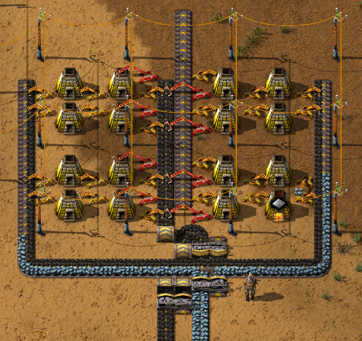

Go to the iron ore patch and add four drills to a new transport belt and connect it to the input of the steel smelting design.  
Split of the existing coal transport belt and connect it to the input of the steel smelting design.

# Trains and oil

While building the train capabilities make sure that the research list is ticked off.  
Add the following to the research list:  
- Railway
- Electric energy distribution 1
- Oil processing
- Automated rail transportation
- Fluid wagon
- Plastics
- Sulfur processing
- Advanced electronics

Go to the coal patch and add two more drills to increase the coal production consumed by the smelters.

Create by hand:
- 1 x Boiler
- 2 x Steam engine

Increase the electric power capacity by adding another set of bolier/steam engine:  
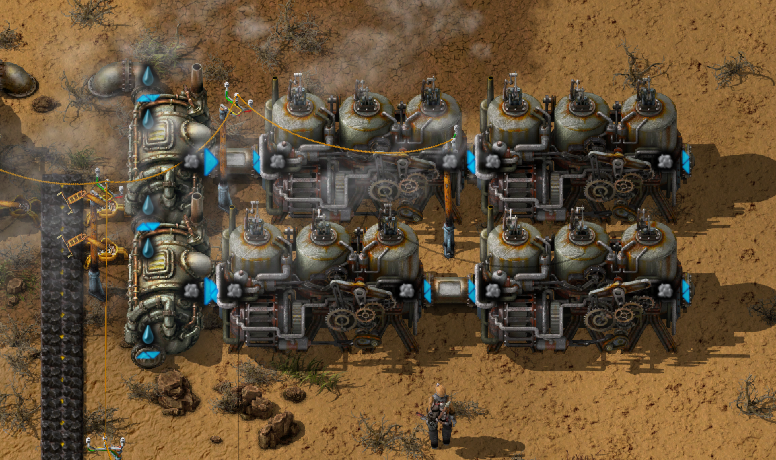

Go to the stone patch and place four drills and a transport belt.  
Extend the stone belt and also the steel belt and its adjacent coal belt to the area of your mall and red/green science.  
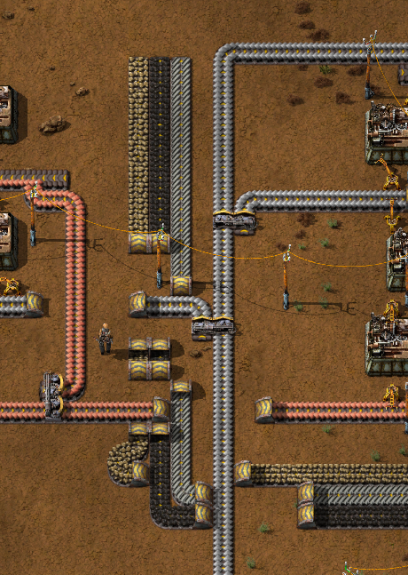

Extend the mall with engines and rails by building the following design (restrict boxes - engines 1 stack, rails 6 stacks):  
<details>
  <summary>:abc: Blueprint string</summary>

  ```
  0eNqdmd2OmzAQhV9l5WuowL+Q+z5FtaogcROrxEQ2dLta5d1ryDZJE0NnfJUEwecZx8czPnyQthv1yRk7kM0HMdveerL59kG82dumm64N7ydNNsQM+kgyYpvj9EvbvbE6H60ZyDkjxu70b7Ipz9l/n3SN6e4eoYBH/NCHsVpntj/vnmTn1yzEMZjB6EvM84/373Y8ttqFaK6AwTXWn3o35K3uhgA+9T481ttpyIDi4ovIyDvZ5Cp8C0PsjNPbyw1zgA9kCidLHJnByQpH5leysV67IVx7ZtZXJg/MCEXA46tw8Uk4ucaRFZgsChy5gpNLHLmGkymOXBZwNEOi4YoTSMWVcMkJjkTfNDeGncXtXR8+l+Bres6u25c9jdO++DzWTYVvfb/TNt8etI+N86ietnGf++sjUgCEfYfjj2HzGFQi5kSWkDnpx2FpUuACldgVCVeoxOoILlGJLS9wiUrkYqdwiUpkgaFwiUpkVaQMsMblf4sX5fAIkTWGwgujRBZGKlP6GApC35Tnj03X5boLt4c+Kz/1nV7tOdjMt9rsD20/uqkBY+w1NkYFaTzUcuAyBq1TOjDQnLDioe/8MTrbbGOzUf+di9hiYyVkXy5weTMKrR/lA3ixfjCGWwN3/QZ9XgNhRTERWwbspr3Ge31sO2P3+bHZHqZzRLlaxi/jhIkxcyU5TR+xIQQyE7mWSZgXpqKZSGwm1VIm/56inkdCylMWqwmJjNXRhCpkQpIuJWRcb/O9blz+dtC6iyZVI5Piq0mpjJexpHiBTUquJuWHy+nzeaASmU+1mk+d8eg2yikyH1Us5fN5An8eArkTqNWdYOFv4SnFrAAdcEVKTSgg7TCXkL1cIKEKAr1FWkIKBK9wpwFYpDWk/SpxUFFAoMVy+rE1ICBF966xhUVKIdAK90cJZEsLixR6vFTsIdq5PYjGCTle3u0EsORlglSnGY5aUirBM5tmFrCcqpQ4Yeg6wUmDoWWRYKUB0WWC4wVE0wSbDohmCZYXEM0TjDogWiS4aUC0THDTgGiE24pUo0TYrUg1SoTfipSMQvitSKErhJmDVKNCmDlINSqWYPcB0TzB7gOiRYLdB0TLBLsPiFYJdh8QXSXYfUB0neDTwdBVkeDTxdCv2eUl5ebuBWpGuiawwrWv88Hev0xHLf/S2N3L/PbSh1t+aecvjKrkqqaKU8YqIc/nPzXtivQ=
  ```
</details>


Pick up a stack of steel from the steel belt.  
Go to the mall and pick up 11 Assembling machine, plus some green circuites and iron cogs.  
Create 11 x Assembling machine 2 and place them on the red/green science setup to upgrade their speed.  
Create 4 x Lab and extend the lab setup:  
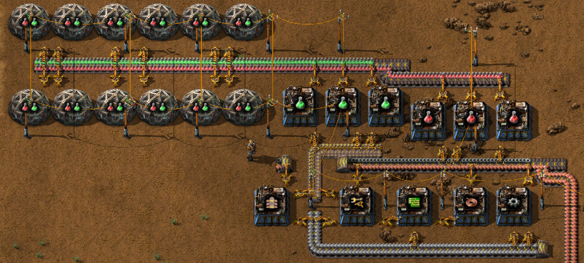

Use the map to find the nearest cluster of oil patches and build one pumpjack for every oil patch by picking up items from the mall and belts.  
Pick up a stack of pipes and a stack of underground pipes from the mall. Make sure you have a couple af stacks of copper-, iron- and steel plates.  
Pick up all stacks of rail from the mall. Also pick up an engine and create one Pump and one Tank.  
Head over to the oil patches and place a Pumpjack one each oil patch. Bind all Pumpjack outlets to one single fluid network and end it with a Tank and a Pump.  
Create a rail roundabout adjacent to the Pump:  
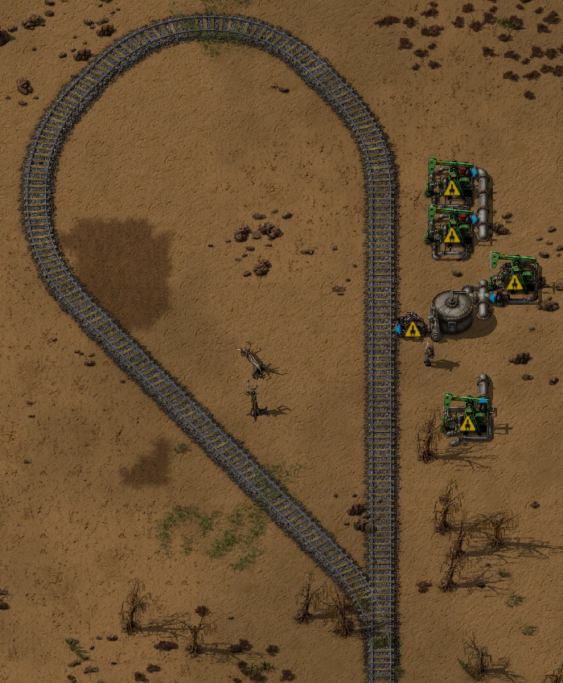

Build a railway path to your base and end it with a roundabout near your mall:  
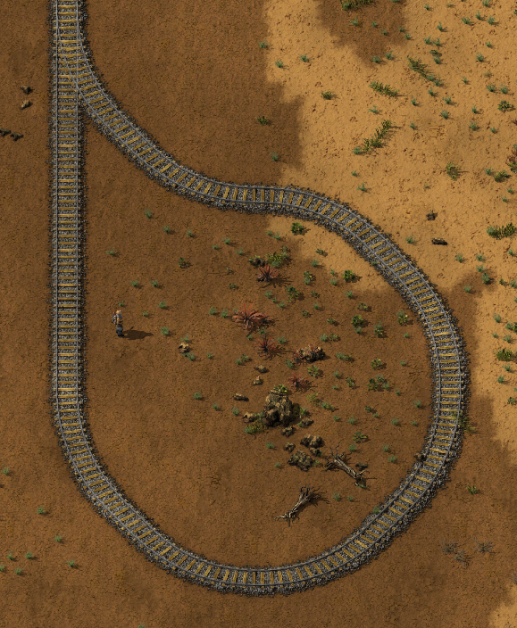

Create 2 x train stop and about 15 big electric poles.  
Pick up 20 x engine from the mall and create one locomotive and one fluid wagon.  
Place the train stop in the roundabout, then place the locomotive at the stop (it should snap in place) and finally connect the fluid wagon to the locomotive.  
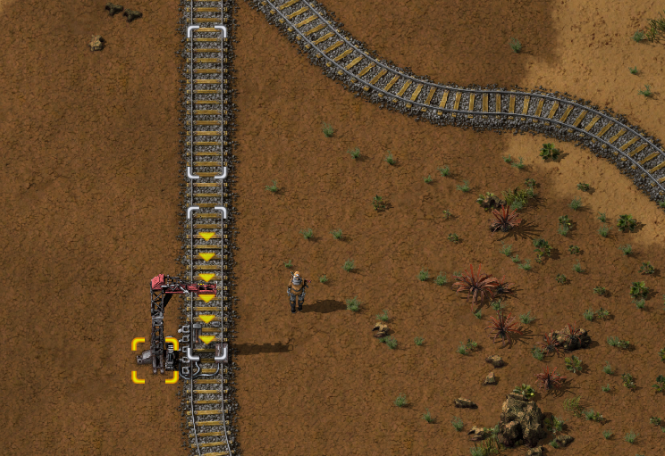
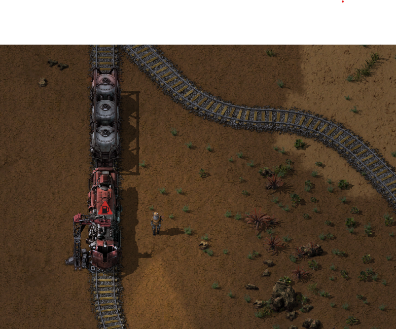

Click on the locomotive and select the fuel tab in the ui. Add 3 stacks of coal to the locomotive.  
Connect one big electric pole to the electric grid but as close to the train stop as possible.  
Step into the train by standing close to it and pressing the enter key. Use the normal forward and back keys to manually drive the train.  
While in the train, select the big electric poles from your inventory and start slowly driving the train forward while at the same time placing poles alongside the rail track.  
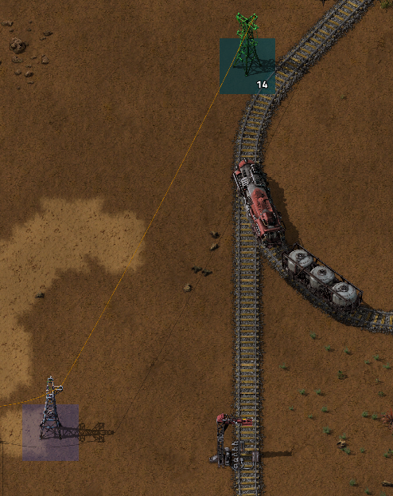

After a while you'll reach the oil patches. Place one final big electric pole near the pumpjacks, step out of the train (also by using the enter key)
and connect the Pump and all Pumpjacks to the electric grid. The Pumpjacks should now all start to move and the Tank should be filling up.  
Place a train stop in the roundabout but make sure it also connects the fluid wagon to the pump:  
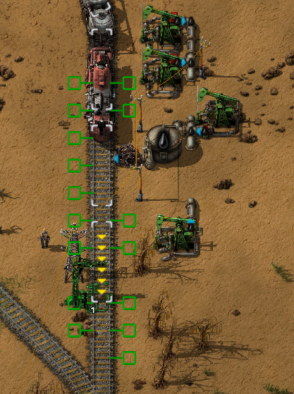

Click the train stop and select the rename button, then rename the stop to "Oil". While you're at it, open the map, select the train stop at the base 
and rename it to "Oil Base".  
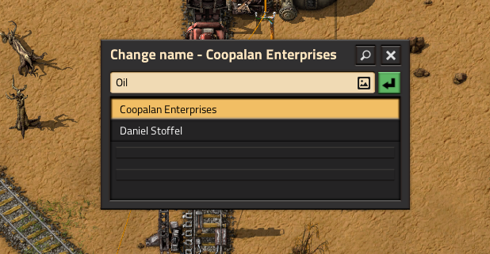

Now it's time to setup an automatic train schedule. Step into the train, then click the locomotive to bring up the train ui.  
First add the "Oil" stop, then the "Oil Base" stop. Add wait conditions as follows:
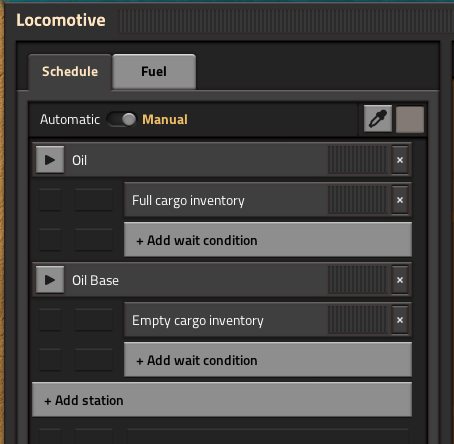

While still in the ui, press the play button next to the "Oil" stop. The train should now automatically drive to the "Oil" stop, the pump should
fill up the fluid wagon (if it doesn't you may need to move the train stop one tile) and then automatically drive to the base where it should stop.

## Summary

By following the guide above you have now set up:  
- Automated steel production
- Increased Research rate by having faster Assemblers and more Labs
- Mall extension: Rails and Engine
- Automated Oil production via Train
